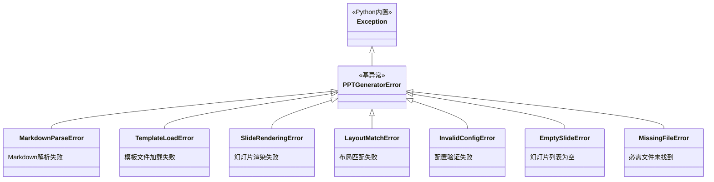
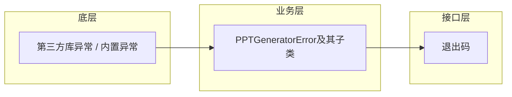
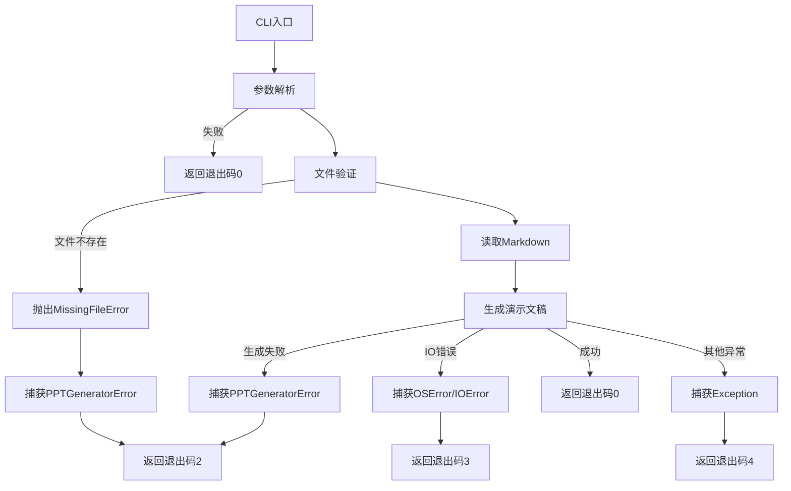

# 异常处理开发文档

## 1. 概述

本模块定义了PPT生成器的完整异常层次结构，支持细粒度的错误处理。所有异常继承自基类 `PPTGeneratorError`，便于统一捕获和处理。

**核心特性**:
- 统一的异常基类，支持批量捕获
- 细粒度的异常分类，便于针对性处理
- 不遮蔽Python内置异常（如 `MissingFileError` 而非 `FileNotFoundError`）
- 清晰的异常层次结构，易于扩展

## 2. 异常架构

### 2.1 异常层次结构图



### 2.2 异常分类表

| 异常类型 | 触发场景 | 责任模块 | 严重程度 |
|----------|----------|----------|----------|
| `PPTGeneratorError` | 所有生成器异常的基类 | core | - |
| `MarkdownParseError` | Markdown语法错误、解析失败 | MarkdownParser | 高 |
| `TemplateLoadError` | 模板文件缺失、损坏、格式错误 | TemplateLoader | 高 |
| `SlideRenderingError` | 幻灯片渲染、保存失败 | PPTGenerator | 高 |
| `LayoutMatchError` | 布局匹配失败 | LayoutMatcher | 中 |
| `InvalidConfigError` | 数据模型验证失败 | models | 高 |
| `EmptySlideError` | Markdown解析后无幻灯片 | MarkdownParser | 中 |
| `MissingFileError` | 必需文件不存在 | utils/cli | 高 |

## 3. 异常详细说明

### 3.1 PPTGeneratorError

**定义位置**: [exceptions.py#L29-L41](file:///C:/Users/frank/Documents/PPT-Generator/src/ppt_generator/core/exceptions.py#L29-L41)

**继承关系**: `Exception` → `PPTGeneratorError`

所有PPT生成器异常的基类，继承自Python内置的 `Exception`。这是PPT生成器引发的所有错误的根异常类，可以用作所有生成器相关异常的统一捕获。

**触发场景**:
- 作为所有生成器异常的父类
- 用于统一捕获所有PPT生成相关错误

**使用示例**:
```python
try:
    generator.generate()
except PPTGeneratorError as e:
    print(f"PPT生成失败: {e}")
```

### 3.2 MarkdownParseError

**定义位置**: [exceptions.py#L44-L57](file:///C:/Users/frank/Documents/PPT-Generator/src/ppt_generator/core/exceptions.py#L44-L57)

**继承关系**: `Exception` → `PPTGeneratorError` → `MarkdownParseError`

当Markdown解析过程中发生错误时引发。当Markdown解析器遇到无效的Markdown语法、意外的Token结构或其他解析错误时引发此异常。

**触发场景**:
- Markdown语法无效
- Token结构异常
- 解析器内部错误

**使用示例**:
```python
try:
    parser = MarkdownParser(markdown_text)
    slides = parser.parse()
except MarkdownParseError as e:
    print(f"解析Markdown失败: {e}")
```

### 3.3 TemplateLoadError

**定义位置**: [exceptions.py#L60-L72](file:///C:/Users/frank/Documents/PPT-Generator/src/ppt_generator/core/exceptions.py#L60-L72)

**继承关系**: `Exception` → `PPTGeneratorError` → `TemplateLoadError`

当PPT模板文件无法加载时引发。当模板文件缺失、损坏或格式不支持时引发此异常。

**触发场景**:
- 模板文件不存在
- 文件损坏
- 格式不支持（非pptx格式）

**使用示例**:
```python
try:
    loader = TemplateLoader(template_path)
except TemplateLoadError as e:
    print(f"加载模板失败: {e}")
```

### 3.4 SlideRenderingError

**定义位置**: [exceptions.py#L75-L87](file:///C:/Users/frank/Documents/PPT-Generator/src/ppt_generator/core/exceptions.py#L75-L87)

**继承关系**: `Exception` → `PPTGeneratorError` → `SlideRenderingError`

当幻灯片渲染或演示文稿保存失败时引发。在演示文稿生成阶段，当幻灯片无法正确渲染时引发此异常，包括添加幻灯片、填充内容或保存演示文稿等问题。

**触发场景**:
- 添加幻灯片失败
- 填充内容失败
- 保存文件失败
- 输出目录不可写

**使用示例**:
```python
try:
    generator.generate()
except SlideRenderingError as e:
    print(f"渲染幻灯片失败: {e}")
```

### 3.5 LayoutMatchError

**定义位置**: [exceptions.py#L90-L102](file:///C:/Users/frank/Documents/PPT-Generator/src/ppt_generator/core/exceptions.py#L90-L102)

**继承关系**: `Exception` → `PPTGeneratorError` → `LayoutMatchError`

当布局匹配失败时引发。当无法为幻灯片规格找到合适的布局，或布局匹配逻辑遇到错误时引发此异常。

**触发场景**:
- 布局列表为空
- 无法找到匹配的布局

**使用示例**:
```python
try:
    layout = matcher.select_layout(slide_spec, layouts)
except LayoutMatchError as e:
    print(f"匹配布局失败: {e}")
```

### 3.6 InvalidConfigError

**定义位置**: [exceptions.py#L105-L117](file:///C:/Users/frank/Documents/PPT-Generator/src/ppt_generator/core/exceptions.py#L105-L117)

**继承关系**: `Exception` → `PPTGeneratorError` → `InvalidConfigError`

当配置无效时引发。在模型验证期间，当输入数据未能通过验证检查时引发此异常。

**触发场景**:
- 必填字段为空
- 数据类型错误
- 值超出有效范围

**使用示例**:
```python
try:
    item = SlideItem(type="", content="text")
except InvalidConfigError as e:
    print(f"配置无效: {e}")
```

### 3.7 EmptySlideError

**定义位置**: [exceptions.py#L120-L132](file:///C:/Users/frank/Documents/PPT-Generator/src/ppt_generator/core/exceptions.py#L120-L132)

**继承关系**: `Exception` → `PPTGeneratorError` → `EmptySlideError`

当幻灯片列表为空时引发。当Markdown解析后没有产生任何幻灯片时引发此异常。

**触发场景**:
- Markdown文件内容为空
- Markdown解析后未生成任何幻灯片

**使用示例**:
```python
try:
    validate_slides([])
except EmptySlideError as e:
    print(f"幻灯片列表为空: {e}")
```

### 3.8 MissingFileError

**定义位置**: [exceptions.py#L135-L148](file:///C:/Users/frank/Documents/PPT-Generator/src/ppt_generator/core/exceptions.py#L135-L148)

**继承关系**: `Exception` → `PPTGeneratorError` → `MissingFileError`

当必需文件未找到时引发。当指定的文件路径不存在且操作必需该文件时引发此异常。

**重要提示**: 此异常名为 `MissingFileError`，不使用 `FileNotFoundError`，以避免遮蔽Python内置的 `FileNotFoundError` 异常，便于在需要时分别捕获。

**触发场景**:
- 输入Markdown文件不存在
- 模板文件不存在
- 其他必需文件路径验证失败

**使用示例**:
```python
try:
    load_theme_pack("missing_dir")
except MissingFileError as e:
    print(f"文件未找到: {e}")
```

## 4. 错误处理设计原则

### 4.1 分层处理



**设计理念**:
- **底层**：捕获第三方库的原始异常（如 `python-pptx` 异常、`FileNotFoundError` 等）
- **业务层**：转换为统一的业务异常（`PPTGeneratorError` 及其子类），携带业务上下文信息
- **接口层**：转换为用户友好的退出码，便于脚本调用和CI/CD集成

### 4.2 异常链

使用 `raise ... from exc` 保留原始异常信息：

```python
try:
    parser = MarkdownParser(self.markdown_text)
    self.slides = parser.parse()
except Exception as exc:
    raise MarkdownParseError(f"解析Markdown失败: {exc}") from exc
```

**优势**:
- 保留完整的异常堆栈
- 便于追溯根本原因
- 支持异常链分析

### 4.3 统一错误消息格式

所有错误消息采用统一格式：

```
{错误描述}: {具体信息}
```

**示例**:
- `Markdown解析失败: 无效的标题层级`
- `模板文件不存在: /path/to/template.pptx`
- `配置无效: type字段不能为空`

### 4.4 不遮蔽内置异常

**原则**: 自定义异常类名不与Python内置异常重名。

**示例**:
- 使用 `MissingFileError` 而非 `FileNotFoundError`
- 好处：可以分别捕获业务异常和系统异常

```python
try:
    # 某些操作
except MissingFileError as e:
    # 处理PPT生成器特定的文件缺失
except FileNotFoundError as e:
    # 处理Python内置的文件缺失
```

## 5. CLI退出码映射

CLI程序通过退出码向调用方传达执行结果，便于脚本集成和自动化流程。

| 退出码 | 含义 | 对应异常 | 说明 |
|--------|------|----------|------|
| 0 | 成功 | - | 演示文稿生成成功 |
| 2 | PPT生成器错误 | `PPTGeneratorError` 及其子类 | Markdown解析失败、模板加载失败、渲染失败等 |
| 3 | 文件IO错误 | `OSError`, `IOError` | 文件读写权限、磁盘空间等系统级IO错误 |
| 4 | 其他意外错误 | `Exception` | 未预料的异常情况 |

**错误处理流程**:


