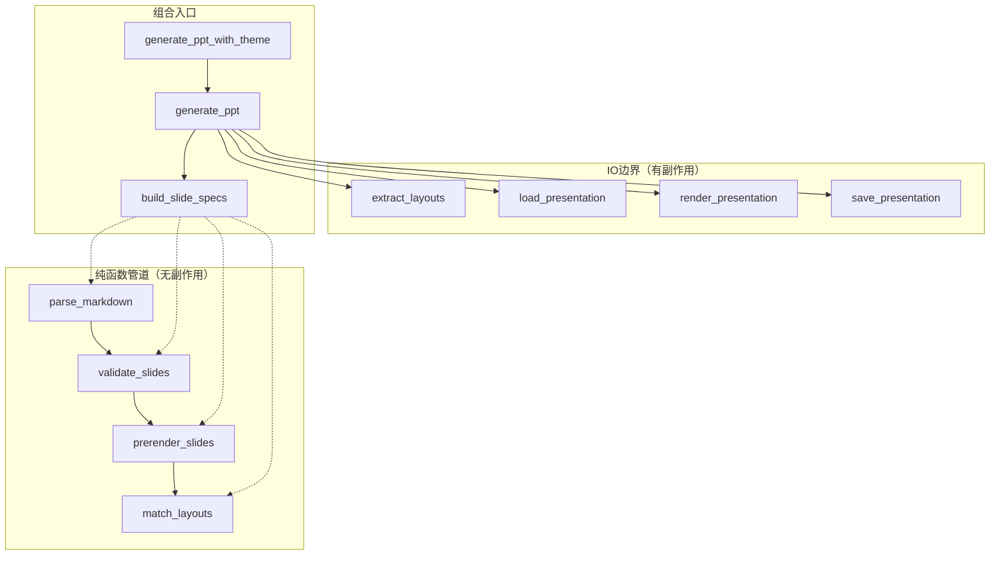
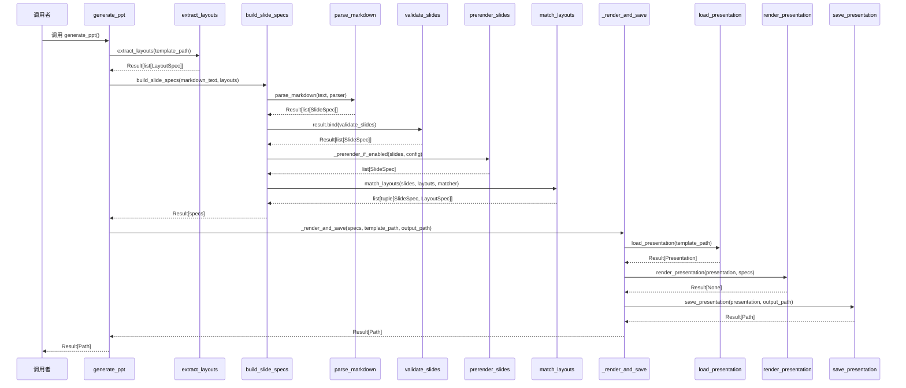

# PPT生成器核心文档

## 1. 概述

PPT生成器核心模块采用函数式工程思想设计，将生成流程拆分为纯函数管道和IO边界，实现副作用与纯计算的彻底分离。

**源文件**: [generator.py](file:///C:/Users/frank/Documents/PPT-Generator/src/ppt_generator/core/generator.py)

## 2. 函数式管道架构

### 2.1 整体架构



### 2.2 设计原则

| 原则 | 说明 |
|------|------|
| **纯函数与IO分离** | 解析、验证、匹配等纯计算与文件读写、渲染等副作用彻底分离 |
| **错误作为值** | 使用 `Result` 类型替代异常抛出，实现可组合的错误处理 |
| **函数式组合** | 使用 `flow` 管道和 `bind` 链组合函数，消除中间变量 |
| **依赖注入** | 解析器、匹配器等通过可选参数注入，便于测试和扩展 |
| **不可变数据** | 数据模型使用不可变配置，确保线程安全和可预测性 |

## 3. 纯函数管道

### 3.1 parse_markdown

**定义位置**: [generator.py#L104-L124](file:///C:/Users/frank/Documents/PPT-Generator/src/ppt_generator/core/generator.py#L104-L124)

解析Markdown文本为幻灯片规格列表。

```python
def parse_markdown(
    markdown_text: str,
    parser: MarkdownParser | None = None,
) -> Result[list[SlideSpec], MarkdownParseError]:
```

**参数**:
- `markdown_text`: Markdown源内容
- `parser`: 可选的Markdown解析器（依赖注入），默认使用 `MarkdownParser`

**返回**: `Success(list[SlideSpec])` 或 `Failure(MarkdownParseError)`

**关键逻辑**:
- 空内容检查：空字符串直接返回 `Failure`
- 异常捕获：解析过程中的异常包装为 `MarkdownParseError`
- 依赖注入：支持自定义解析器替换默认实现

### 3.2 validate_slides

**定义位置**: [generator.py#L127-L143](file:///C:/Users/frank/Documents/PPT-Generator/src/ppt_generator/core/generator.py#L127-L143)

验证幻灯片列表。

```python
def validate_slides(slides: list[SlideSpec]) -> Result[list[SlideSpec], EmptySlideError]:
```

**参数**:
- `slides`: 幻灯片规格列表

**返回**: `Success(list[SlideSpec])` 或 `Failure(EmptySlideError)`

**验证规则**:
- 空列表检查：无幻灯片时返回 `Failure(EmptySlideError)`
- 标题警告：无标题的幻灯片记录警告日志（不阻塞流程）

### 3.3 match_layouts

**定义位置**: [generator.py#L146-L171](file:///C:/Users/frank/Documents/PPT-Generator/src/ppt_generator/core/generator.py#L146-L171)

为每个幻灯片匹配布局。

```python
def match_layouts(
    slides: list[SlideSpec],
    layouts: list[LayoutSpec],
    style_config: StyleConfig | None = None,
    matcher: LayoutMatcher | None = None,
) -> list[tuple[SlideSpec, LayoutSpec]]:
```

**参数**:
- `slides`: 幻灯片规格列表
- `layouts`: 可用布局列表
- `style_config`: 样式配置（用于自定义布局规则）
- `matcher`: 可选的布局匹配器（依赖注入），默认使用 `LayoutMatcher`

**返回**: `(SlideSpec, LayoutSpec)` 元组列表

**匹配策略**:
- 使用 `LayoutMatcher.select_layout()` 返回 `Maybe[LayoutSpec]`
- 匹配失败时回退到第一个布局（或默认布局）
- 通过 `value_or()` 安全处理 `Maybe` 类型

```python
def match_slide(slide: SlideSpec) -> tuple[SlideSpec, LayoutSpec]:
    matched = match_fn.select_layout(slide, layouts)
    default = layouts[0] if layouts else LayoutSpec(name="Default", placeholders=[])
    layout = matched.value_or(default)
    return (slide, layout)
```

### 3.4 build_slide_specs

**定义位置**: [generator.py#L174-L205](file:///C:/Users/frank/Documents/PPT-Generator/src/ppt_generator/core/generator.py#L174-L205)

构建完整的幻灯片规格管道，将解析、验证、预渲染、匹配组合为单一入口。

```python
def build_slide_specs(
    markdown_text: str,
    layouts: list[LayoutSpec],
    style_config: StyleConfig | None = None,
    *,
    parser: MarkdownParser | None = None,
    matcher: LayoutMatcher | None = None,
    prerender_config: PrerenderConfig | None = None,
) -> Result[list[tuple[SlideSpec, LayoutSpec]], Exception]:
```

**参数**:
- `markdown_text`: Markdown源内容
- `layouts`: 可用布局列表
- `style_config`: 样式配置
- `parser`: 可选的Markdown解析器
- `matcher`: 可选的布局匹配器
- `prerender_config`: 预渲染配置

**返回**: `Success(list[tuple[SlideSpec, LayoutSpec]])` 或 `Failure(Exception)`

**管道组合**:

```python
return flow(
    markdown_text,
    lambda text: parse_markdown(text, parser),
    lambda result: result.bind(validate_slides),
    lambda result: result.map(lambda slides: _prerender_if_enabled(slides, config, prerender_config)),
    lambda result: result.map(lambda slides: match_layouts(slides, layouts, config, matcher)),
)
```

**组合方式说明**:
- `flow`: 函数式管道组合器，从左到右依次应用函数
- `bind`: 铁路式错误传播，失败时短路
- `map`: 成功时转换值，失败时保持错误

### 3.5 _prerender_if_enabled

**定义位置**: [generator.py#L208-L226](file:///C:/Users/frank/Documents/PPT-Generator/src/ppt_generator/core/generator.py#L208-L226)

根据配置决定是否执行预渲染。

```python
def _prerender_if_enabled(
    slides: list[SlideSpec],
    style_config: StyleConfig,
    prerender_config: PrerenderConfig | None,
) -> list[SlideSpec]:
```

**预渲染集成**:
- 配置存在时调用 `prerender_slides()` 执行预渲染管线
- 配置为 `None` 时直接返回原幻灯片列表
- 预渲染包括代码高亮、Mermaid图表、LaTeX公式等

## 4. 渲染层

### 4.1 渲染器注册表

**定义位置**: [generator.py#L95-L101](file:///C:/Users/frank/Documents/PPT-Generator/src/ppt_generator/core/generator.py#L95-L101)

内容类型到渲染函数的映射表。

```python
RENDERERS: dict[SlideItemType, Callable[[Presentation, SlideItem, StyleConfig], None]] = {
    SlideItemType.PARAGRAPH: render_paragraph_with_style,
    SlideItemType.LIST: render_list_with_style,
    SlideItemType.CODE: render_code_block,
    SlideItemType.TABLE: render_table,
    SlideItemType.IMAGE: render_image,
}
```

### 4.2 样式渲染函数

| 函数 | 定义位置 | 功能 |
|------|----------|------|
| `render_paragraph_with_style` | [generator.py#L63-L69](file:///C:/Users/frank/Documents/PPT-Generator/src/ppt_generator/core/generator.py#L63-L69) | 渲染段落，支持富文本样式 |
| `render_list_with_style` | [generator.py#L72-L78](file:///C:/Users/frank/Documents/PPT-Generator/src/ppt_generator/core/generator.py#L72-L78) | 渲染列表，支持富文本样式 |
| `render_code_block` | [generator.py#L81-L87](file:///C:/Users/frank/Documents/PPT-Generator/src/ppt_generator/core/generator.py#L81-L87) | 渲染代码块，预渲染结果作为图片插入 |
| `render_table` | [generator.py#L90-L92](file:///C:/Users/frank/Documents/PPT-Generator/src/ppt_generator/core/generator.py#L90-L92) | 渲染表格 |

### 4.3 render_slide

**定义位置**: [generator.py#L229-L252](file:///C:/Users/frank/Documents/PPT-Generator/src/ppt_generator/core/generator.py#L229-L252)

渲染单个幻灯片（有副作用）。

```python
def render_slide(
    presentation: Presentation,
    slide_spec: SlideSpec,
    layout_spec: LayoutSpec,
    style_config: StyleConfig,
    title: str = "Presentation",
) -> None:
```

**参数**:
- `presentation`: Presentation对象
- `slide_spec`: 幻灯片规格
- `layout_spec`: 布局规格
- `style_config`: 样式配置
- `title`: 默认标题

**渲染流程**:
1. 通过布局名称查找布局索引（失败时使用索引0）
2. 添加新幻灯片
3. 渲染标题
4. 遍历内容项，调用对应渲染器

### 4.4 render_presentation

**定义位置**: [generator.py#L255-L272](file:///C:/Users/frank/Documents/PPT-Generator/src/ppt_generator/core/generator.py#L255-L272)

渲染完整演示文稿。

```python
def render_presentation(
    presentation: Presentation,
    specs: list[tuple[SlideSpec, LayoutSpec]],
    style_config: StyleConfig,
    title: str = "Presentation",
) -> None:
```

**参数**:
- `presentation`: Presentation对象
- `specs`: (SlideSpec, LayoutSpec)元组列表
- `style_config`: 样式配置
- `title`: 演示文稿标题

**流程**:
1. 设置演示文稿元数据标题
2. 遍历幻灯片规格，逐张渲染

## 5. 铁路式错误传播

### 5.1 Result bind 链

核心生成流程使用 `Result.bind` 实现铁路式错误传播，任何一步失败都会短路并返回错误。

**示例：_build_and_render**

**定义位置**: [generator.py#L370-L404](file:///C:/Users/frank/Documents/PPT-Generator/src/ppt_generator/core/generator.py#L370-L404)

```python
return build_slide_specs(
    markdown_text, layouts, style_config, parser=parser, matcher=matcher, prerender_config=prerender_config
).bind(lambda specs: _render_and_save(
    specs, template_path, output_path, style_config, title
))
```

### 5.2 完整生成流程的错误传播

**示例：_render_and_save**

**定义位置**: [generator.py#L407-L441](file:///C:/Users/frank/Documents/PPT-Generator/src/ppt_generator/core/generator.py#L407-L441)

```python
return (
    load_presentation(template_path)
    .bind(lambda presentation: (
        _try_render(presentation, specs, style_config, title)
        .map(lambda _: presentation)
    ))
    .bind(lambda presentation: (
        save_presentation(presentation, output_path)
        .map(lambda _: (
            logger.info(f"演示文稿已成功生成: {output_path}"),
            output_path,
        )[1])
    ))
)
```

**错误传播链**:
1. `load_presentation` → 失败则终止，返回 `TemplateLoadError`
2. `_try_render` → 失败则终止，返回渲染异常
3. `save_presentation` → 失败则终止，返回保存错误
4. 全部成功 → 返回 `Success(output_path)`

### 5.3 _try_render

**定义位置**: [generator.py#L444-L465](file:///C:/Users/frank/Documents/PPT-Generator/src/ppt_generator/core/generator.py#L444-L465)

将渲染操作的异常包装为 `Result` 类型。

```python
def _try_render(
    presentation: Presentation,
    specs: list[tuple[SlideSpec, LayoutSpec]],
    style_config: StyleConfig,
    title: str,
) -> Result[None, Exception]:
```

**作用**: 桥接异常风格代码和Result风格代码，将抛出的异常捕获并包装为 `Failure`

## 6. 顶层生成函数

### 6.1 generate_ppt

**定义位置**: [generator.py#L275-L308](file:///C:/Users/frank/Documents/PPT-Generator/src/ppt_generator/core/generator.py#L275-L308)

生成PPT文件的完整流程（使用模板文件）。

```python
def generate_ppt(
    markdown_text: str,
    template_path: Path,
    output_path: Path,
    title: str = "Presentation",
    *,
    parser: MarkdownParser | None = None,
    matcher: LayoutMatcher | None = None,
    prerender_config: PrerenderConfig | None = None,
) -> Result[Path, Exception]:
```

**参数**:
- `markdown_text`: Markdown源内容
- `template_path`: 模板文件路径
- `output_path`: 输出文件路径
- `title`: 演示文稿标题
- `parser`: 可选的Markdown解析器
- `matcher`: 可选的布局匹配器
- `prerender_config`: 预渲染配置

**返回**: `Success(Path)` 或 `Failure(Exception)`

### 6.2 generate_ppt_with_theme

**定义位置**: [generator.py#L311-L345](file:///C:/Users/frank/Documents/PPT-Generator/src/ppt_generator/core/generator.py#L311-L345)

生成PPT文件的完整流程（使用主题包）。

```python
def generate_ppt_with_theme(
    markdown_text: str,
    theme_pack: ThemePack,
    output_path: Path,
    title: str = "Presentation",
    *,
    parser: MarkdownParser | None = None,
    matcher: LayoutMatcher | None = None,
    prerender_config: PrerenderConfig | None = None,
) -> Result[Path, Exception]:
```

**参数**:
- `markdown_text`: Markdown源内容
- `theme_pack`: 主题包（包含模板路径、样式配置、布局配置）
- `output_path`: 输出文件路径
- `title`: 演示文稿标题
- `parser`: 可选的Markdown解析器
- `matcher`: 可选的布局匹配器
- `prerender_config`: 预渲染配置

**主题包集成**:
- 从 `theme_pack.template_path` 获取模板路径
- 使用 `theme_pack.style_config` 作为样式配置
- 使用 `theme_pack.layout_config` 初始化布局匹配器
- 支持自定义匹配器覆盖默认配置

```python
effective_matcher = matcher or LayoutMatcher(layout_config=theme_pack.layout_config)
```

### 6.3 _generate

**定义位置**: [generator.py#L348-L367](file:///C:/Users/frank/Documents/PPT-Generator/src/ppt_generator/core/generator.py#L348-L367)

生成PPT的内部实现，统一处理模板和主题包两种模式。

```python
def _generate(
    markdown_text: str,
    template_path: Path,
    output_path: Path,
    title: str,
    style_config: StyleConfig,
    parser: MarkdownParser | None,
    matcher: LayoutMatcher | None,
    prerender_config: PrerenderConfig | None,
) -> Result[Path, Exception]:
```

**flow 管道**:

```python
return flow(
    template_path,
    extract_layouts,
    lambda result: result.bind(
        lambda layouts: _build_and_render(
            layouts, markdown_text, template_path, output_path, title, style_config, parser, matcher, prerender_config
        )
    ),
)
```

## 7. PPTGenerator 类（Facade）

### 7.1 类定义

**定义位置**: [generator.py#L468-L539](file:///C:/Users/frank/Documents/PPT-Generator/src/ppt_generator/core/generator.py#L468-L539)

从Markdown和PPT模板生成PowerPoint演示文稿的主类，作为Facade模式提供面向对象接口。

```python
class PPTGenerator:
```

**设计意图**:
- 保持向后兼容性
- 内部委托给函数式管道实现
- 支持模板文件和主题包两种模式

### 7.2 构造函数

**定义位置**: [generator.py#L474-L494](file:///C:/Users/frank/Documents/PPT-Generator/src/ppt_generator/core/generator.py#L474-L494)

```python
def __init__(
    self,
    markdown_text: str,
    template_path: Path | None = None,
    output_path: Path | None = None,
    title: str = "Presentation",
    *,
    theme_pack: ThemePack | None = None,
    parser: MarkdownParser | None = None,
    matcher: LayoutMatcher | None = None,
    prerender_config: PrerenderConfig | None = None,
) -> None:
```

**参数**:
- `markdown_text`: Markdown源内容
- `template_path`: 模板文件路径（与theme_pack二选一）
- `output_path`: 输出文件路径
- `title`: 演示文稿标题
- `theme_pack`: 主题包（与template_path二选一）
- `parser`: 可选的Markdown解析器
- `matcher`: 可选的布局匹配器
- `prerender_config`: 预渲染配置

### 7.3 generate 方法

**定义位置**: [generator.py#L496-L527](file:///C:/Users/frank/Documents/PPT-Generator/src/ppt_generator/core/generator.py#L496-L527)

执行完整的生成管道。

```python
def generate(self) -> None:
```

**执行逻辑**:
1. 若提供 `theme_pack`，调用 `generate_ppt_with_theme()`
2. 若提供 `template_path`，调用 `generate_ppt()`
3. 两者都未提供，抛出 `ValueError`
4. 结果为 `Failure` 时抛出异常

**异常**:
- `ValueError`: 未提供 `template_path` 或 `theme_pack`
- `Exception`: 生成失败时抛出 `Failure` 中包装的异常

### 7.4 result 属性

**定义位置**: [generator.py#L529-L532](file:///C:/Users/frank/Documents/PPT-Generator/src/ppt_generator/core/generator.py#L529-L532)

返回生成结果的 `Result` 对象。

```python
@property
def result(self) -> Result[Path, Exception] | None:
```

### 7.5 metadata_json 方法

**定义位置**: [generator.py#L534-L539](file:///C:/Users/frank/Documents/PPT-Generator/src/ppt_generator/core/generator.py#L534-L539)

将演示文稿元数据导出为JSON。

```python
def metadata_json(self) -> bytes:
```

## 8. 依赖注入

### 8.1 函数级注入

所有核心函数支持通过可选参数注入依赖：

| 依赖 | 注入参数 | 默认实现 |
|------|----------|----------|
| Markdown解析器 | `parser: MarkdownParser \| None` | `MarkdownParser` |
| 布局匹配器 | `matcher: LayoutMatcher \| None` | `LayoutMatcher` |

### 8.2 注入示例

**自定义解析器**:

```python
class CustomParser:
    def parse(self) -> list[SlideSpec]:
        # 自定义解析逻辑
        ...

result = generate_ppt(
    markdown_text,
    template_path,
    output_path,
    parser=CustomParser(),
)
```

**自定义匹配器**:

```python
class CustomMatcher:
    def select_layout(self, slide_spec, layouts):
        # 自定义匹配逻辑
        ...

result = generate_ppt(
    markdown_text,
    template_path,
    output_path,
    matcher=CustomMatcher(),
)
```

### 8.3 PPTGenerator 类注入

```python
generator = PPTGenerator(
    markdown_text="...",
    template_path=Path("template.pptx"),
    output_path=Path("output.pptx"),
    parser=CustomParser(),
    matcher=CustomMatcher(),
    prerender_config=PrerenderConfig(...),
)
generator.generate()
```

## 9. 预渲染集成

### 9.1 集成点

预渲染在 `build_slide_specs` 管道中通过 `_prerender_if_enabled` 函数集成，位于验证之后、布局匹配之前。

**管道顺序**:
```
parse_markdown → validate_slides → prerender_slides → match_layouts
```

### 9.2 配置方式

通过 `prerender_config` 参数启用预渲染：

```python
from ppt_generator.core.models import PrerenderConfig

config = PrerenderConfig(
    enable_code_highlight=True,
    enable_mermaid=True,
    enable_latex=True,
)

result = generate_ppt(
    markdown_text,
    template_path,
    output_path,
    prerender_config=config,
)
```

### 9.3 代码块渲染

**定义位置**: [generator.py#L81-L87](file:///C:/Users/frank/Documents/PPT-Generator/src/ppt_generator/core/generator.py#L81-L87)

代码块的渲染支持预渲染结果：
- 若 `item.meta` 中包含 `PrerenderResult`，则作为图片渲染
- 否则作为普通段落渲染

```python
def render_code_block(slide: Presentation, item: SlideItem, style_config: StyleConfig) -> None:
    prerender = item.meta.get("prerender")
    if isinstance(prerender, PrerenderResult):
        render_image(slide, item, style_config)
        return
    render_paragraph(slide, item.content)
```

## 10. 布局匹配集成

### 10.1 集成点

布局匹配在 `match_layouts` 函数中完成，通过 `LayoutMatcher` 执行匹配逻辑。

### 10.2 匹配流程

1. 调用 `LayoutMatcher.select_layout(slide, layouts)` 获取 `Maybe[LayoutSpec]`
2. 使用 `value_or(default)` 处理匹配失败的情况
3. 返回 `(SlideSpec, LayoutSpec)` 元组列表

### 10.3 主题包布局配置

使用主题包时，布局匹配器自动使用主题包中的布局配置：

```python
effective_matcher = matcher or LayoutMatcher(layout_config=theme_pack.layout_config)
```

## 11. 完整生成流程总结



**关键特性**:
- 每一步都可能失败，错误通过 `Result.bind` 自动短路传播
- 纯函数步骤（解析、验证、匹配）无副作用，易于测试
- IO步骤（加载、渲染、保存）集中管理，边界清晰
- 依赖通过参数注入，灵活可扩展
