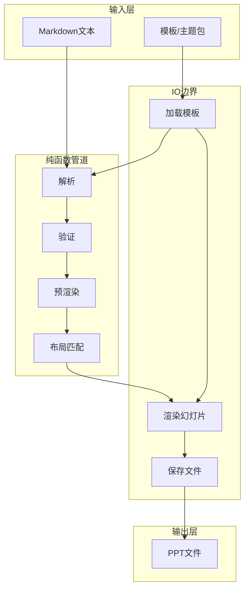

# PPT-Generator 文档

欢迎来到PPT-Generator的官方文档。本项目采用函数式编程范式，从结构化Markdown和PPT母版模板生成PowerPoint演示文稿。

## 快速导航

### 核心模块

| 模块 | 文档 | 说明 |
|------|------|------|
| 核心引擎 | [core/generator.md](core/generator.md) | 生成器核心，函数式管道编排 |
| 数据模型 | [core/models.md](core/models.md) | 不可变数据结构定义 |
| 异常处理 | [core/exceptions.md](core/exceptions.md) | 完整的异常层次结构 |
| CLI接口 | [core/cli.md](core/cli.md) | 命令行工具文档 |
| 工具函数 | [core/utils.md](core/utils.md) | 路径、哈希、颜色、YAML、子进程等工具 |

### 解析与匹配

| 模块 | 文档 | 说明 |
|------|------|------|
| Markdown解析 | [parsers/markdown_parser.md](parsers/markdown_parser.md) | 函数式Markdown解析器 |
| 布局匹配 | [matching/layout_matcher.md](matching/layout_matcher.md) | 使用Maybe Monad的布局选择器 |

### 渲染与预渲染

| 模块 | 文档 | 说明 |
|------|------|------|
| IO边界 | [rendering/rendering.md](rendering/rendering.md) | PPT渲染的副作用操作 |
| 预渲染管线 | [prerendering/prerendering.md](prerendering/prerendering.md) | 代码高亮、Mermaid、LaTeX预渲染 |

### 模板与主题

| 模块 | 文档 | 说明 |
|------|------|------|
| 模板加载 | [templates/template_loader.md](templates/template_loader.md) | PPT模板加载和布局提取 |
| 主题系统 | [themes/themes.md](themes/themes.md) | 主题包加载和样式配置 |
| 模板开发指南 | [themes/template_development_guide.md](themes/template_development_guide.md) | 完整的模板制作和主题开发指南 |
| 主题包规范 | [SPEC.md](../SPEC.md) | 主题包标准规范文档 |

## 架构概览

### 函数式架构



### 模块依赖关系

```mermaid
classDiagram
    class "core" {
        <<package>>
        generator.py
        models.py
        exceptions.py
    }
    
    class "parsers" {
        <<package>>
        markdown_parser.py
    }
    
    class "matching" {
        <<package>>
        layout_matcher.py
    }
    
    class "templates" {
        <<package>>
        template_loader.py
    }
    
    class "prerendering" {
        <<package>>
        pipeline.py
        code_highlight.py
        mermaid_renderer.py
        latex_renderer.py
    }
    
    class "rendering" {
        <<package>>
        io_effects.py
    }
    
    class "themes" {
        <<package>>
        theme_pack.py
    }
    
    core --> parsers
    core --> matching
    core --> templates
    core --> prerendering
    core --> rendering
    core --> themes
    prerendering --> core
    rendering --> core
    rendering --> templates
    themes --> core
```

## 核心概念

### 纯函数与副作用分离

项目将代码分为两类：

- **纯函数**: 无副作用、可测试、可缓存
  - `parse_markdown`, `validate_slides`, `match_layouts`, `prerender_slides`

- **副作用函数**: IO操作、状态变更
  - `load_presentation`, `save_presentation`, `render_slide`

### 铁路式编程

使用`Result`类型实现错误传播，避免异常：

```python
result = parse_markdown(text)           # Result[list[SlideSpec], Error]
result = result.bind(validate_slides)   # 链式错误传播
result = result.map(process)            # 成功时转换
```

### Maybe Monad

处理可选值，避免空指针异常：

```python
matched = matcher.select_layout(slide, layouts)  # Maybe[LayoutSpec]
layout = matched.value_or(default_layout)         # 安全回退
```

### 依赖注入

支持自定义解析器、匹配器等组件：

```python
def generate_ppt(
    ...,
    *,
    parser: MarkdownParser | None = None,
    matcher: LayoutMatcher | None = None,
    prerender_config: PrerenderConfig | None = None,
) -> Result[Path, Exception]:
```

### 语义与视觉分离

主题包采用语义与视觉分离的架构设计：

- **语义层**：`layouts.yaml` 定义布局的用途、关键词、匹配规则
- **视觉层**：`template.pptx` 定义布局的外观、配色、字体
- **样式层**：`style.yaml` 定义内容元素的样式参数

## 快速开始

### 安装

```bash
pip install -e .
```

### 基本用法

**命令行**:
```bash
ppt-generator input.md template.pptx output.pptx --title "我的演示文稿"
```

**编程接口**:
```python
from ppt_generator import PPTGenerator
from pathlib import Path

generator = PPTGenerator(
    markdown_text=open("input.md").read(),
    template_path=Path("template.pptx"),
    output_path=Path("output.pptx"),
    title="我的演示文稿",
)
generator.generate()
```

### 使用主题包

```python
from ppt_generator.themes import load_theme_pack
from ppt_generator import PPTGenerator

theme = load_theme_pack(Path("themes/business-blue"))
generator = PPTGenerator(
    markdown_text=open("input.md").read(),
    output_path=Path("output.pptx"),
    theme_pack=theme,
)
generator.generate()
```

## 文档索引

### 按功能分类

#### 数据处理
- [数据模型](core/models.md) - 所有核心数据结构（23个模型）
- [异常处理](core/exceptions.md) - 异常层次结构
- [工具函数](core/utils.md) - 通用工具函数集（7个函数）

#### 内容解析
- [Markdown解析](parsers/markdown_parser.md) - Markdown到SlideSpec的转换
- [布局匹配](matching/layout_matcher.md) - SlideSpec与布局的匹配

#### PPT操作
- [模板加载](templates/template_loader.md) - PPT模板加载和布局提取
- [渲染模块](rendering/rendering.md) - 幻灯片内容渲染

#### 高级功能
- [预渲染管线](prerendering/prerendering.md) - 代码高亮、图表、公式渲染
- [主题系统](themes/themes.md) - 主题包和样式配置
- [模板开发指南](themes/template_development_guide.md) - 完整的模板制作指南

#### 用户接口
- [CLI文档](core/cli.md) - 命令行工具使用说明
- [生成器核心](core/generator.md) - 编程接口详细文档

### 按文件路径

```
docs/
├── index.md                          # 本文件 - 导航枢纽
├── core/
│   ├── generator.md                  # 生成器核心文档
│   ├── models.md                     # 数据模型文档
│   ├── exceptions.md                 # 异常处理文档
│   ├── cli.md                        # 命令行接口文档
│   └── utils.md                      # 工具函数文档
├── parsers/
│   └── markdown_parser.md            # Markdown解析器文档
├── matching/
│   └── layout_matcher.md             # 布局匹配器文档
├── templates/
│   └── template_loader.md            # 模板加载器文档
├── prerendering/
│   └── prerendering.md               # 预渲染管线文档
├── rendering/
│   └── rendering.md                  # 渲染模块文档
└── themes/
    ├── themes.md                     # 主题系统文档
    └── template_development_guide.md # 模板开发指南
```

## 版本说明

- **规范版本**: 1.0
- **兼容生成器版本**: >=1.0.0

## 相关资源

- [README.md](../README.md) - 项目概述和快速开始
- [SPEC.md](../SPEC.md) - 主题包标准规范
- [examples/](../examples/) - 示例文件和模板