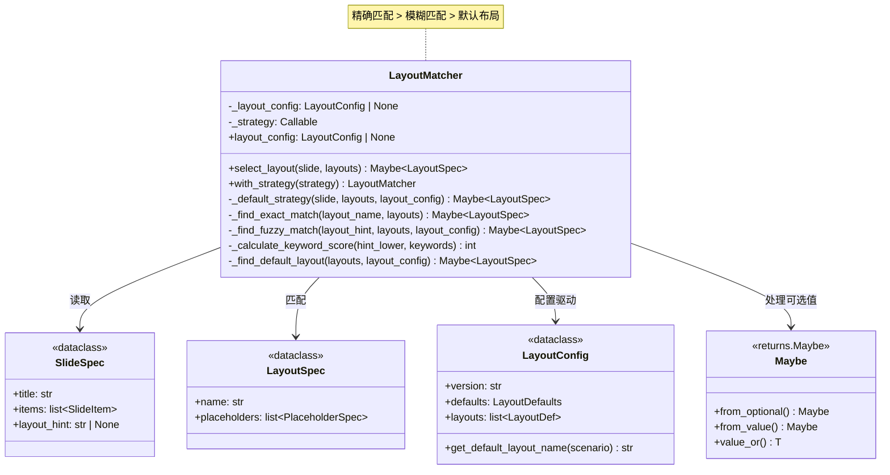
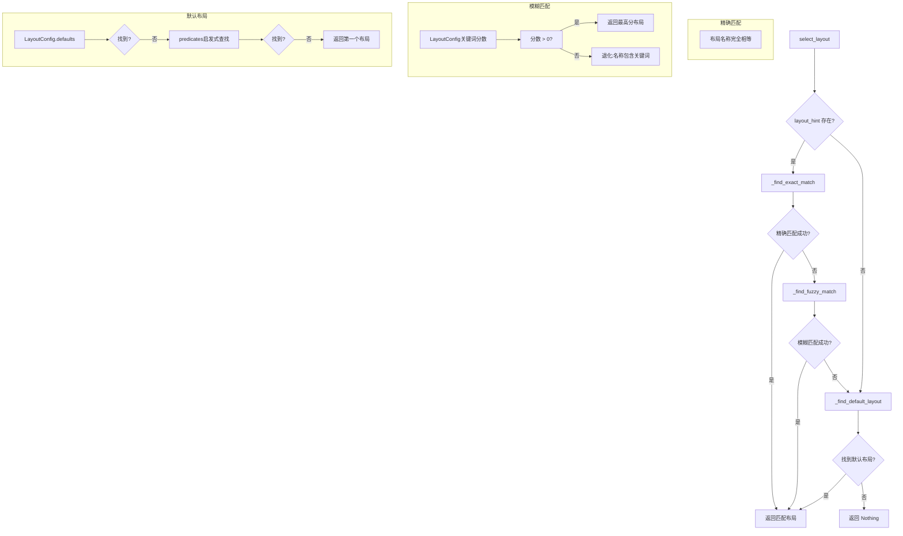

# 布局匹配器开发文档

## 1. 概述

本模块负责根据幻灯片规格（SlideSpec）自动选择最合适的模板布局（LayoutSpec）。布局匹配器采用分层匹配策略，结合 `layouts.yaml` 中定义的布局配置（LayoutConfig），实现从精确匹配到模糊匹配再到默认布局的渐进式查找。

核心特性：

- **三级匹配策略**：精确匹配 > 关键词模糊匹配 > 默认布局
- **配置驱动**：通过 LayoutConfig（layouts.yaml）定义布局元数据、关键词和默认布局
- **函数式编程**：使用 `returns.Maybe` Monad 优雅处理可选值
- **不可变设计**：`with_strategy` 方法支持不可变的策略更新
- **可扩展**：支持自定义匹配策略和工厂函数创建带规则的匹配器

**定义位置**：[src/ppt_generator/matching/layout_matcher.py](file:///C:/Users/frank/Documents/PPT-Generator/src/ppt_generator/matching/layout_matcher.py)

## 2. 匹配器架构

### 2.1 类图



### 2.2 匹配流程图



## 3. 核心组件

### 3.1 LayoutMatcher 类

**定义位置**：[src/ppt_generator/matching/layout_matcher.py:22-213](file:///C:/Users/frank/Documents/PPT-Generator/src/ppt_generator/matching/layout_matcher.py#L22-L213)

布局匹配器主类，根据幻灯片规格和 LayoutConfig 自动选择最合适的布局。

#### 构造函数

**定义位置**：[src/ppt_generator/matching/layout_matcher.py:29-41](file:///C:/Users/frank/Documents/PPT-Generator/src/ppt_generator/matching/layout_matcher.py#L29-L41)

```python
def __init__(
    self,
    layout_config: LayoutConfig | None = None,
    strategy: Callable[[SlideSpec, list[LayoutSpec], LayoutConfig | None], Maybe[LayoutSpec]] | None = None,
) -> None:
```

**参数说明**：

| 参数 | 类型 | 说明 |
|------|------|------|
| `layout_config` | `LayoutConfig \| None` | 布局配置，来自 layouts.yaml。None 时使用退化策略 |
| `strategy` | `Callable \| None` | 自定义匹配策略函数。None 时使用默认策略 |

**私有属性**：

| 属性 | 类型 | 说明 |
|------|------|------|
| `_layout_config` | `LayoutConfig \| None` | 布局配置 |
| `_strategy` | `Callable` | 匹配策略函数 |

#### 公共方法

##### select_layout

**定义位置**：[src/ppt_generator/matching/layout_matcher.py:43-53](file:///C:/Users/frank/Documents/PPT-Generator/src/ppt_generator/matching/layout_matcher.py#L43-L53)

选择最合适的布局。

```python
def select_layout(self, slide: SlideSpec, layouts: list[LayoutSpec]) -> Maybe[LayoutSpec]:
```

**参数**：
- `slide: SlideSpec` - 幻灯片规格
- `layouts: list[LayoutSpec]` - 可用布局列表

**返回**：`Maybe[LayoutSpec]`，包含匹配的布局或 Nothing

##### with_strategy

**定义位置**：[src/ppt_generator/matching/layout_matcher.py:193-208](file:///C:/Users/frank/Documents/PPT-Generator/src/ppt_generator/matching/layout_matcher.py#L193-L208)

返回使用新策略的 LayoutMatcher 实例（不可变更新）。

```python
def with_strategy(
    self,
    strategy: Callable[[SlideSpec, list[LayoutSpec], LayoutConfig | None], Maybe[LayoutSpec]],
) -> LayoutMatcher:
```

**参数**：
- `strategy: Callable` - 自定义匹配策略函数

**返回**：新的 `LayoutMatcher` 实例

##### layout_config 属性

**定义位置**：[src/ppt_generator/matching/layout_matcher.py:210-213](file:///C:/Users/frank/Documents/PPT-Generator/src/ppt_generator/matching/layout_matcher.py#L210-L213)

获取布局配置的只读属性。

```python
@property
def layout_config(self) -> LayoutConfig | None:
```

#### 私有方法

| 方法 | 定义位置 | 说明 |
|------|----------|------|
| `_default_strategy` | [L55-L84](file:///C:/Users/frank/Documents/PPT-Generator/src/ppt_generator/matching/layout_matcher.py#L55-L84) | 默认布局匹配策略 |
| `_find_exact_match` | [L86-L98](file:///C:/Users/frank/Documents/PPT-Generator/src/ppt_generator/matching/layout_matcher.py#L86-L98) | 查找精确匹配的布局 |
| `_find_fuzzy_match` | [L100-L140](file:///C:/Users/frank/Documents/PPT-Generator/src/ppt_generator/matching/layout_matcher.py#L100-L140) | 根据布局提示查找模糊匹配 |
| `_calculate_keyword_score` | [L142-L152](file:///C:/Users/frank/Documents/PPT-Generator/src/ppt_generator/matching/layout_matcher.py#L142-L152) | 计算关键词匹配分数 |
| `_find_default_layout` | [L154-L191](file:///C:/Users/frank/Documents/PPT-Generator/src/ppt_generator/matching/layout_matcher.py#L154-L191) | 查找默认布局 |

### 3.2 create_matcher_with_rules 工厂函数

**定义位置**：[src/ppt_generator/matching/layout_matcher.py:216-247](file:///C:/Users/frank/Documents/PPT-Generator/src/ppt_generator/matching/layout_matcher.py#L216-L247)

创建带有自定义匹配规则的布局匹配器。

```python
def create_matcher_with_rules(
    custom_rules: list[tuple[str, list[str]]],
    layout_config: LayoutConfig | None = None,
) -> LayoutMatcher:
```

**参数**：

| 参数 | 类型 | 说明 |
|------|------|------|
| `custom_rules` | `list[tuple[str, list[str]]]` | 自定义匹配规则列表，每个规则是 (目标布局名称, 关键词列表) |
| `layout_config` | `LayoutConfig \| None` | 可选的布局配置 |

**返回**：`LayoutMatcher` 实例

**工作机制**：

1. 构建自定义策略函数 `custom_strategy`
2. 首先检查 `layout_hint` 是否包含所有指定关键词（全部匹配才触发）
3. 如果触发规则，在布局列表中查找名称包含目标布局名称的布局
4. 如果自定义规则未匹配，回退到默认策略

## 4. 匹配策略详解

默认策略实现于 `_default_strategy` 方法，采用三级匹配机制，优先级从高到低：

**定义位置**：[src/ppt_generator/matching/layout_matcher.py:55-84](file:///C:/Users/frank/Documents/PPT-Generator/src/ppt_generator/matching/layout_matcher.py#L55-L84)

### 4.1 第一级：精确匹配

**实现方法**：`_find_exact_match`  
**定义位置**：[src/ppt_generator/matching/layout_matcher.py:86-98](file:///C:/Users/frank/Documents/PPT-Generator/src/ppt_generator/matching/layout_matcher.py#L86-L98)

```python
def _find_exact_match(self, layout_name: str, layouts: list[LayoutSpec]) -> Maybe[LayoutSpec]:
    return Maybe.from_optional(
        next((layout for layout in layouts if layout.name == layout_name), None)
    )
```

**匹配规则**：布局名称完全相等（区分大小写）

**执行条件**：`slide.layout_hint` 不为空时执行

### 4.2 第二级：关键词模糊匹配

**实现方法**：`_find_fuzzy_match`  
**定义位置**：[src/ppt_generator/matching/layout_matcher.py:100-140](file:///C:/Users/frank/Documents/PPT-Generator/src/ppt_generator/matching/layout_matcher.py#L100-L140)

分两种模式：

#### 模式 A：LayoutConfig 关键词匹配

当 `layout_config` 不为 None 时：

1. 遍历 `layout_config.layouts` 中的所有布局定义
2. 使用 `_calculate_keyword_score` 计算每个布局的关键词匹配分数
3. 取最高分的布局定义
4. 如果分数 > 0，在实际可用布局列表中查找对应名称的布局
5. 找到则返回

#### 模式 B：退化模式（名称包含匹配）

当 `layout_config` 为 None 或关键词匹配失败时：

1. 将 `layout_hint` 按空格拆分为多个关键词
2. 在布局列表中查找名称包含任一关键词的布局
3. 返回第一个匹配的布局

### 4.3 第三级：默认布局

**实现方法**：`_find_default_layout`  
**定义位置**：[src/ppt_generator/matching/layout_matcher.py:154-191](file:///C:/Users/frank/Documents/PPT-Generator/src/ppt_generator/matching/layout_matcher.py#L154-L191)

分三层回退：

#### 第一层：LayoutConfig 默认布局

当 `layout_config` 不为 None 时：

1. 调用 `layout_config.get_default_layout_name("default")` 获取默认布局名称
2. 在可用布局列表中查找对应名称的布局
3. 找到则返回

#### 第二层：启发式查找（predicates 列表）

当 LayoutConfig 默认布局未找到时，按优先级顺序尝试：

```python
predicates: list[Callable[[LayoutSpec], bool]] = [
    lambda l: "title" in l.name.lower() and "content" in l.name.lower(),
    lambda l: "content" in l.name.lower(),
]
```

| 优先级 | 匹配规则 | 说明 |
|--------|----------|------|
| 1 | 名称同时包含 "title" 和 "content" | 优先选择标题内容布局 |
| 2 | 名称包含 "content" | 其次选择包含内容的布局 |

#### 第三层：第一个布局

如果以上都失败，且布局列表非空，返回列表中的第一个布局。

如果布局列表为空，返回 `Nothing`。

## 5. 关键词分数计算

**实现方法**：`_calculate_keyword_score`  
**定义位置**：[src/ppt_generator/matching/layout_matcher.py:142-152](file:///C:/Users/frank/Documents/PPT-Generator/src/ppt_generator/matching/layout_matcher.py#L142-L152)

```python
def _calculate_keyword_score(self, hint_lower: str, keywords: list[str]) -> int:
    return sum(1 for kw in keywords if kw.lower() in hint_lower)
```

**计算规则**：

- 分数 = 匹配的关键词数量
- 不区分大小写（均转为小写比较）
- 关键词为子串匹配（`in` 操作符）
- 最小分数为 0（无匹配），最大分数为关键词列表长度

**示例**：

假设某布局的关键词为 `["图表", "数据", "分析"]`，layout_hint 为 "数据分析图表页"：

| 关键词 | 是否匹配 |
|--------|----------|
| "图表" | 是 |
| "数据" | 是 |
| "分析" | 是 |

总分数 = 3

## 6. Maybe Monad 应用

布局匹配器使用 `returns.maybe.Maybe` Monad 处理可选值，避免空指针异常，实现流畅的链式调用。

**导入位置**：[src/ppt_generator/matching/layout_matcher.py:17](file:///C:/Users/frank/Documents/PPT-Generator/src/ppt_generator/matching/layout_matcher.py#L17-L17)

### 6.1 Maybe 的使用场景

| 方法 | Maybe 用法 | 说明 |
|------|------------|------|
| `_find_exact_match` | `Maybe.from_optional(...)` | 将 None 转为 Nothing |
| `_find_fuzzy_match` | `Maybe.from_value(...)` / `Maybe.from_optional(...)` | 包裹匹配结果 |
| `_find_default_layout` | `Maybe.from_value(...)` / `Nothing` | 有值时包裹，无值时返回 Nothing |
| `select_layout` | 直接返回策略函数的 Maybe 结果 | 透传 Maybe 类型 |

### 6.2 Maybe 两种状态

- **Just**：包含值的状态，表示匹配成功
- **Nothing**：不包含值的状态，表示匹配失败

### 6.3 与外部交互

`select_layout` 方法返回 `Maybe[LayoutSpec]`，调用方可以使用：

- `.value_or(default)` - 获取值或默认值
- `.map(fn)` - 对值应用函数
- `.bind(fn)` - 链式调用返回 Maybe 的函数
- `== Nothing` - 判断是否为空

## 7. 不可变设计（with_strategy）

LayoutMatcher 采用不可变设计模式，通过 `with_strategy` 方法实现策略的安全替换。

**定义位置**：[src/ppt_generator/matching/layout_matcher.py:193-208](file:///C:/Users/frank/Documents/PPT-Generator/src/ppt_generator/matching/layout_matcher.py#L193-L208)

### 7.1 设计特点

1. **不修改原实例**：原匹配器的 `_strategy` 保持不变
2. **复用配置**：新实例共享同一个 `_layout_config`
3. **返回新实例**：创建并返回全新的 LayoutMatcher 实例

### 7.2 使用示例

```python
# 创建基础匹配器
base_matcher = LayoutMatcher(layout_config=config)

# 定义自定义策略
def my_strategy(slide, layouts, lc):
    # 自定义匹配逻辑
    ...

# 创建使用新策略的匹配器（原匹配器不受影响）
custom_matcher = base_matcher.with_strategy(my_strategy)
```

## 8. 扩展方式（自定义策略）

### 8.1 使用 with_strategy

适合基于已有匹配器快速替换策略。

```python
matcher = LayoutMatcher(layout_config=config)

def custom_strategy(
    slide: SlideSpec,
    layouts: list[LayoutSpec],
    layout_config: LayoutConfig | None,
) -> Maybe[LayoutSpec]:
    # 自定义匹配逻辑
    ...

custom_matcher = matcher.with_strategy(custom_strategy)
```

### 8.2 使用 create_matcher_with_rules

适合基于关键词规则快速创建匹配器。

```python
rules = [
    ("Title Slide", ["标题", "封面"]),
    ("Two Content", ["两栏", "对比"]),
]

matcher = create_matcher_with_rules(rules, layout_config=config)
```

### 8.3 完全自定义策略

直接构造 LayoutMatcher 并传入自定义策略函数。

```python
def smart_strategy(
    slide: SlideSpec,
    layouts: list[LayoutSpec],
    layout_config: LayoutConfig | None,
) -> Maybe[LayoutSpec]:
    item_count = len(slide.items)
    
    if item_count == 0:
        return Maybe.from_optional(
            next((l for l in layouts if "Blank" in l.name), None)
        )
    
    if item_count > 5:
        return Maybe.from_optional(
            next((l for l in layouts if "Two Content" in l.name), None)
        )
    
    base = LayoutMatcher(layout_config=layout_config)
    return base._default_strategy(slide, layouts, layout_config)

matcher = LayoutMatcher(strategy=smart_strategy)
```

### 8.4 策略函数签名

```python
Callable[[SlideSpec, list[LayoutSpec], LayoutConfig | None], Maybe[LayoutSpec]]
```

| 参数位置 | 类型 | 说明 |
|----------|------|------|
| 1 | `SlideSpec` | 幻灯片规格 |
| 2 | `list[LayoutSpec]` | 可用布局列表 |
| 3 | `LayoutConfig \| None` | 布局配置 |
| 返回 | `Maybe[LayoutSpec]` | 匹配结果 |
