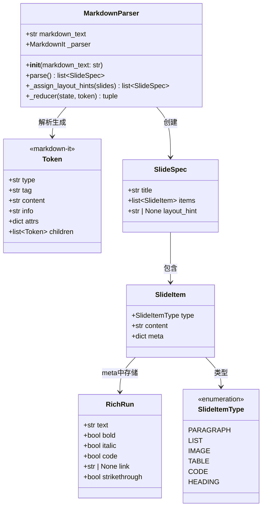
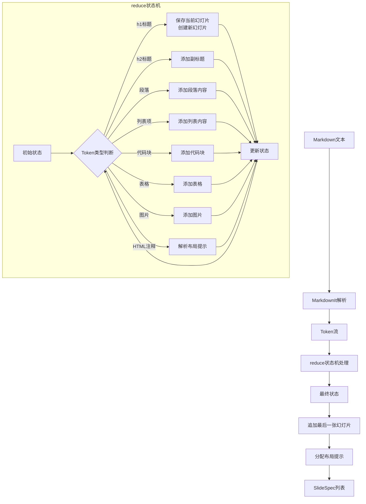

# Markdown解析器开发文档

## 1. 概述

本模块负责将结构化的Markdown文本解析为幻灯片规格列表(SlideSpec)。解析器使用函数式编程风格，通过 `reduce` 函数处理 Token 流，并使用 `returns.Maybe` monad 处理可能为空的状态。

**定义位置**: [src/ppt_generator/parsers/markdown_parser.py](file:///C:/Users/frank/Documents/PPT-Generator/src/ppt_generator/parsers/markdown_parser.py)

### 1.1 核心特性

- **支持丰富的Markdown语法**：h1标题、h2副标题、段落、无序列表、有序列表、代码块、表格、图片、内联格式（加粗/斜体/行内代码/删除线/链接）
- **布局提示解析**：通过HTML注释指定幻灯片布局
- **富文本解析**：支持RichRun语义格式
- **函数式设计**：reduce状态机、Maybe Monad、_update_or_create高阶组合器
- **自动布局推断**：根据幻灯片内容智能推断布局类型

## 2. 解析器架构

### 2.1 类图



### 2.2 解析流程图



## 3. 核心组件

### 3.1 MarkdownParser 类

**定义位置**: [src/ppt_generator/parsers/markdown_parser.py#L463-L619](file:///C:/Users/frank/Documents/PPT-Generator/src/ppt_generator/parsers/markdown_parser.py#L463-L619)

将Markdown文本解析为幻灯片规格的主类。使用 `markdown-it-py` 库解析Markdown，通过 `reduce` 函数处理Token流。

| 属性 | 类型 | 说明 |
|------|------|------|
| `markdown_text` | `str` | 要解析的Markdown文本 |
| `_parser` | `MarkdownIt` | markdown-it解析器实例，启用table和strikethrough插件 |

| 方法 | 返回值 | 说明 |
|------|--------|------|
| `__init__(markdown_text: str)` | - | 初始化解析器，配置MarkdownIt |
| `parse()` | `list[SlideSpec]` | 解析Markdown文本并返回幻灯片规格列表 |
| `_assign_layout_hints(slides)` | `list[SlideSpec]` | 为幻灯片列表分配布局提示 |
| `_reducer(state, token)` | `tuple` | Token流的reduce函数，状态机核心 |

**使用示例**:

```python
from src.ppt_generator.parsers.markdown_parser import MarkdownParser

parser = MarkdownParser("# 标题\n\n内容段落")
slides = parser.parse()
```

#### 3.1.1 `__init__` 方法

**定义位置**: [src/ppt_generator/parsers/markdown_parser.py#L470-L478](file:///C:/Users/frank/Documents/PPT-Generator/src/ppt_generator/parsers/markdown_parser.py#L470-L478)

初始化解析器，配置 `MarkdownIt` 实例：
- 使用 `commonmark` 预设
- 启用HTML支持 (`html: True`)
- 启用 `table` 和 `strikethrough` 插件

#### 3.1.2 `parse` 方法

**定义位置**: [src/ppt_generator/parsers/markdown_parser.py#L480-L498](file:///C:/Users/frank/Documents/PPT-Generator/src/ppt_generator/parsers/markdown_parser.py#L480-L498)

解析流程：
1. 调用 `_parser.parse()` 生成Token流
2. 使用 `reduce` 函数和 `_reducer` 处理Token流
3. 追加最后一张未完成的幻灯片
4. 调用 `_assign_layout_hints` 分配布局提示
5. 返回 `SlideSpec` 列表

状态元组结构：`(slides, current_slide, in_list_item, in_table, pending_layout_hint)`

#### 3.1.3 `_assign_layout_hints` 方法

**定义位置**: [src/ppt_generator/parsers/markdown_parser.py#L500-L518](file:///C:/Users/frank/Documents/PPT-Generator/src/ppt_generator/parsers/markdown_parser.py#L500-L518)

为幻灯片列表分配布局提示。如果幻灯片已有显式布局提示则保留，否则根据内容和位置自动推断。

### 3.2 辅助函数

#### 3.2.1 `_token_text`

**定义位置**: [src/ppt_generator/parsers/markdown_parser.py#L37-L50](file:///C:/Users/frank/Documents/PPT-Generator/src/ppt_generator/parsers/markdown_parser.py#L37-L50)

从Token中提取文本内容。

- 如果Token类型为 `text`，直接返回其 `content`
- 否则从子Token中收集所有 `text` 类型的内容

#### 3.2.2 `_update_or_create`

**定义位置**: [src/ppt_generator/parsers/markdown_parser.py#L53-L72](file:///C:/Users/frank/Documents/PPT-Generator/src/ppt_generator/parsers/markdown_parser.py#L53-L72)

高阶组合器：更新已有幻灯片或创建新幻灯片。统一处理 `_reducer` 中重复的模式。

参数：
- `slide_maybe`: 当前幻灯片的 Maybe 值
- `updater`: 接收已有幻灯片并返回更新后幻灯片的函数
- `fallback_factory`: 当没有当前幻灯片时创建新幻灯片的函数

返回：包含更新后或新创建幻灯片的 Maybe 值

#### 3.2.3 `_parse_inline_runs`

**定义位置**: [src/ppt_generator/parsers/markdown_parser.py#L75-L125](file:///C:/Users/frank/Documents/PPT-Generator/src/ppt_generator/parsers/markdown_parser.py#L75-L125)

解析inline token中的子元素，生成RichRun列表。支持递归处理嵌套格式。

#### 3.2.4 Token类型判断函数

| 函数名 | 定义位置 | 说明 |
|--------|----------|------|
| `_is_h1_heading_open` | [L128-L137](file:///C:/Users/frank/Documents/PPT-Generator/src/ppt_generator/parsers/markdown_parser.py#L128-L137) | 判断是否为h1标题开始标记 |
| `_is_h1_heading_close` | [L140-L149](file:///C:/Users/frank/Documents/PPT-Generator/src/ppt_generator/parsers/markdown_parser.py#L140-L149) | 判断是否为h1标题结束标记 |
| `_is_h2_heading_open` | [L152-L161](file:///C:/Users/frank/Documents/PPT-Generator/src/ppt_generator/parsers/markdown_parser.py#L152-L161) | 判断是否为h2标题开始标记 |
| `_is_h2_heading_close` | [L164-L173](file:///C:/Users/frank/Documents/PPT-Generator/src/ppt_generator/parsers/markdown_parser.py#L164-L173) | 判断是否为h2标题结束标记 |
| `_is_inline` | [L176-L185](file:///C:/Users/frank/Documents/PPT-Generator/src/ppt_generator/parsers/markdown_parser.py#L176-L185) | 判断是否为inline类型 |
| `_is_list_item_open` | [L188-L197](file:///C:/Users/frank/Documents/PPT-Generator/src/ppt_generator/parsers/markdown_parser.py#L188-L197) | 判断是否为列表项开始标记 |
| `_is_list_item_close` | [L200-L209](file:///C:/Users/frank/Documents/PPT-Generator/src/ppt_generator/parsers/markdown_parser.py#L200-L209) | 判断是否为列表项结束标记 |
| `_is_code_block_open` | [L212-L221](file:///C:/Users/frank/Documents/PPT-Generator/src/ppt_generator/parsers/markdown_parser.py#L212-L221) | 判断是否为代码块开始标记 |
| `_is_table_open` | [L224-L233](file:///C:/Users/frank/Documents/PPT-Generator/src/ppt_generator/parsers/markdown_parser.py#L224-L233) | 判断是否为表格开始标记 |
| `_is_table_close` | [L236-L245](file:///C:/Users/frank/Documents/PPT-Generator/src/ppt_generator/parsers/markdown_parser.py#L236-L245) | 判断是否为表格结束标记 |
| `_is_image` | [L248-L257](file:///C:/Users/frank/Documents/PPT-Generator/src/ppt_generator/parsers/markdown_parser.py#L248-L257) | 判断是否为图片标记 |

#### 3.2.5 `_parse_layout_hint_from_comment`

**定义位置**: [src/ppt_generator/parsers/markdown_parser.py#L260-L275](file:///C:/Users/frank/Documents/PPT-Generator/src/ppt_generator/parsers/markdown_parser.py#L260-L275)

从HTML注释中解析布局提示。使用正则表达式匹配 `layout:` 前缀的内容。

#### 3.2.6 `_append_slide`

**定义位置**: [src/ppt_generator/parsers/markdown_parser.py#L278-L288](file:///C:/Users/frank/Documents/PPT-Generator/src/ppt_generator/parsers/markdown_parser.py#L278-L288)

将幻灯片追加到列表中。如果slide为None则不添加。

#### 3.2.7 `_infer_layout_hint`

**定义位置**: [src/ppt_generator/parsers/markdown_parser.py#L291-L325](file:///C:/Users/frank/Documents/PPT-Generator/src/ppt_generator/parsers/markdown_parser.py#L291-L325)

根据幻灯片内容推断布局提示。详见第8节。

#### 3.2.8 内容项添加函数

| 函数名 | 定义位置 | 说明 |
|--------|----------|------|
| `_add_paragraph_item` | [L328-L347](file:///C:/Users/frank/Documents/PPT-Generator/src/ppt_generator/parsers/markdown_parser.py#L328-L347) | 添加段落内容项 |
| `_add_list_item` | [L350-L365](file:///C:/Users/frank/Documents/PPT-Generator/src/ppt_generator/parsers/markdown_parser.py#L350-L365) | 添加列表内容项 |
| `_add_code_block_item` | [L368-L383](file:///C:/Users/frank/Documents/PPT-Generator/src/ppt_generator/parsers/markdown_parser.py#L368-L383) | 添加代码块内容项 |
| `_add_table_item` | [L386-L402](file:///C:/Users/frank/Documents/PPT-Generator/src/ppt_generator/parsers/markdown_parser.py#L386-L402) | 添加表格内容项 |
| `_add_image_item` | [L405-L421](file:///C:/Users/frank/Documents/PPT-Generator/src/ppt_generator/parsers/markdown_parser.py#L405-L421) | 添加图片内容项 |

#### 3.2.9 `_parse_table`

**定义位置**: [src/ppt_generator/parsers/markdown_parser.py#L424-L460](file:///C:/Users/frank/Documents/PPT-Generator/src/ppt_generator/parsers/markdown_parser.py#L424-L460)

解析表格Token，返回表格内容、行数、列数和结束索引。

## 4. 解析算法详解

### 4.1 reduce状态机

解析器使用 `functools.reduce` 函数实现状态机模式。状态机遍历Token流，逐步构建幻灯片列表。

**状态元组结构**:

```python
tuple[list[SlideSpec], Maybe[SlideSpec], bool, bool, str | None]
```

| 位置 | 名称 | 类型 | 说明 |
|------|------|------|------|
| 0 | `slides` | `list[SlideSpec]` | 已完成的幻灯片列表 |
| 1 | `current_slide` | `Maybe[SlideSpec]` | 当前正在构建的幻灯片 |
| 2 | `in_list_item` | `bool` | 是否处于列表项上下文中 |
| 3 | `in_table` | `bool` | 是否处于表格上下文中 |
| 4 | `pending_layout_hint` | `str \| None` | 待应用的布局提示 |

**核心代码** ([src/ppt_generator/parsers/markdown_parser.py#L488-L492](file:///C:/Users/frank/Documents/PPT-Generator/src/ppt_generator/parsers/markdown_parser.py#L488-L492)):

```python
slides, current_slide, in_list_item, in_table, _ = reduce(
    self._reducer,
    tokens,
    ([], Maybe.from_optional(None), False, False, None)
)
```

### 4.2 状态转换

#### 4.2.1 HTML注释处理 ([L538-L548](file:///C:/Users/frank/Documents/PPT-Generator/src/ppt_generator/parsers/markdown_parser.py#L538-L548))

当遇到 `html_inline` 或 `html_block` Token时：
- 尝试解析布局提示
- 如果找到布局提示，保存到 `pending_layout_hint`
- 其他状态不变

#### 4.2.2 h1标题处理 ([L550-L554](file:///C:/Users/frank/Documents/PPT-Generator/src/ppt_generator/parsers/markdown_parser.py#L550-L554))

当遇到h1标题开始标记时：
1. 将当前幻灯片（如果存在）追加到slides列表
2. 创建新的空幻灯片，应用待处理的布局提示
3. 重置 `in_list_item` 和 `in_table` 状态
4. 清除 `pending_layout_hint`

#### 4.2.3 段落内容处理 ([L556-L568](file:///C:/Users/frank/Documents/PPT-Generator/src/ppt_generator/parsers/markdown_parser.py#L556-L568))

当遇到不在列表和表格上下文中的inline Token时：
1. 提取文本内容，空内容直接跳过
2. 解析内联格式生成RichRun列表
3. 使用 `_update_or_create` 添加段落内容

#### 4.2.4 列表项处理

- **列表项开始** ([L570-L571](file:///C:/Users/frank/Documents/PPT-Generator/src/ppt_generator/parsers/markdown_parser.py#L570-L571)): 设置 `in_list_item = True`
- **列表项结束** ([L573-L574](file:///C:/Users/frank/Documents/PPT-Generator/src/ppt_generator/parsers/markdown_parser.py#L573-L574)): 设置 `in_list_item = False`
- **列表项内容** ([L576-L588](file:///C:/Users/frank/Documents/PPT-Generator/src/ppt_generator/parsers/markdown_parser.py#L576-L588)): 在列表上下文中的inline内容作为列表项添加

#### 4.2.5 代码块处理 ([L590-L599](file:///C:/Users/frank/Documents/PPT-Generator/src/ppt_generator/parsers/markdown_parser.py#L590-L599))

当遇到代码块(fence)时：
1. 提取语言和内容
2. 使用 `_update_or_create` 添加代码块内容项

#### 4.2.6 表格处理

- **表格开始** ([L601-L602](file:///C:/Users/frank/Documents/PPT-Generator/src/ppt_generator/parsers/markdown_parser.py#L601-L602)): 设置 `in_table = True`
- **表格结束** ([L604-L605](file:///C:/Users/frank/Documents/PPT-Generator/src/ppt_generator/parsers/markdown_parser.py#L604-L605)): 设置 `in_table = False`

#### 4.2.7 图片处理 ([L607-L617](file:///C:/Users/frank/Documents/PPT-Generator/src/ppt_generator/parsers/markdown_parser.py#L607-L617))

当遇到图片Token时：
1. 提取src和alt属性
2. 使用 `_update_or_create` 添加图片内容项

### 4.3 Maybe Monad的使用

`returns.maybe.Maybe` 用于安全地处理可能不存在的 `current_slide`，避免空指针异常。

**常用操作**:

| 方法 | 说明 | 示例位置 |
|------|------|----------|
| `Maybe.from_optional(None)` | 创建空的Maybe | [L491](file:///C:/Users/frank/Documents/PPT-Generator/src/ppt_generator/parsers/markdown_parser.py#L491) |
| `Maybe.from_value(value)` | 包装值为Maybe | [L554](file:///C:/Users/frank/Documents/PPT-Generator/src/ppt_generator/parsers/markdown_parser.py#L554) |
| `.map(func)` | 对Just值应用函数 | [L551](file:///C:/Users/frank/Documents/PPT-Generator/src/ppt_generator/parsers/markdown_parser.py#L551) |
| `.value_or(default)` | 获取值或默认值 | [L494](file:///C:/Users/frank/Documents/PPT-Generator/src/ppt_generator/parsers/markdown_parser.py#L494) |
| `.or_else_call(func)` | Nothing时调用函数生成默认值 | [L71](file:///C:/Users/frank/Documents/PPT-Generator/src/ppt_generator/parsers/markdown_parser.py#L71) |

**典型模式** ([src/ppt_generator/parsers/markdown_parser.py#L551-L553](file:///C:/Users/frank/Documents/PPT-Generator/src/ppt_generator/parsers/markdown_parser.py#L551-L553)):

```python
new_slides = current_slide.map(
    lambda slide: _append_slide(slides, slide)
).value_or(slides)
```

## 5. 支持的Markdown语法

### 5.1 h1标题（幻灯片分隔符）

**语法**: `# 标题文本`

**作用**: 作为新幻灯片的开始，h1标题文本成为幻灯片标题。

**示例**:

```markdown
# 欢迎使用PPT Generator

这是第一张幻灯片的内容。

# 第二张幻灯片

这是第二张幻灯片的内容。
```

**解析结果**: 生成两张 `SlideSpec`，标题分别为"欢迎使用PPT Generator"和"第二张幻灯片"。

**相关代码**: `_is_h1_heading_open` ([L128-L137](file:///C:/Users/frank/Documents/PPT-Generator/src/ppt_generator/parsers/markdown_parser.py#L128-L137))

### 5.2 h2副标题

**语法**: `## 副标题文本`

**作用**: 作为幻灯片的副标题或章节标题。

**示例**:

```markdown
# 主要标题

## 副标题

正文内容。
```

### 5.3 段落

**语法**: 普通文本行

**作用**: 作为幻灯片的段落内容。

**示例**:

```markdown
# 幻灯片标题

这是第一个段落。

这是第二个段落。
```

**解析结果**: 两个 `SlideItemType.PARAGRAPH` 类型的内容项。

**相关代码**: `_add_paragraph_item` ([L328-L347](file:///C:/Users/frank/Documents/PPT-Generator/src/ppt_generator/parsers/markdown_parser.py#L328-L347))

### 5.4 无序列表

**语法**: 使用 `*`、`+` 或 `-` 开头

**作用**: 作为列表内容项。

**示例**:

```markdown
# 功能特性

* 功能一
* 功能二
* 功能三
```

**解析结果**: 三个 `SlideItemType.LIST` 类型的内容项。

**相关代码**: `_add_list_item` ([L350-L365](file:///C:/Users/frank/Documents/PPT-Generator/src/ppt_generator/parsers/markdown_parser.py#L350-L365))

### 5.5 有序列表

**语法**: 使用数字加 `.` 开头

**作用**: 作为有序列表内容项。

**示例**:

```markdown
# 使用步骤

1. 第一步
2. 第二步
3. 第三步
```

**解析结果**: 三个 `SlideItemType.LIST` 类型的内容项（有序和无序列表统一为LIST类型）。

### 5.6 代码块

**语法**: 使用三个反引号包裹，可指定语言

**作用**: 作为代码块内容项。

**示例**:

````markdown
# 代码示例

```python
def hello():
    print("Hello, World!")
```
````

**解析结果**: 一个 `SlideItemType.CODE` 类型的内容项，meta中包含 `language` 字段。

**相关代码**: `_add_code_block_item` ([L368-L383](file:///C:/Users/frank/Documents/PPT-Generator/src/ppt_generator/parsers/markdown_parser.py#L368-L383))

### 5.7 表格

**语法**: 标准Markdown表格语法

**作用**: 作为表格内容项。

**示例**:

```markdown
# 数据对比

| 特性 | 方案A | 方案B |
|------|-------|-------|
| 性能 | 高 | 中 |
| 成本 | 低 | 高 |
```

**解析结果**: 一个 `SlideItemType.TABLE` 类型的内容项，meta中包含 `rows` 和 `cols` 字段。

**相关代码**: 
- `_parse_table` ([L424-L460](file:///C:/Users/frank/Documents/PPT-Generator/src/ppt_generator/parsers/markdown_parser.py#L424-L460))
- `_add_table_item` ([L386-L402](file:///C:/Users/frank/Documents/PPT-Generator/src/ppt_generator/parsers/markdown_parser.py#L386-L402))

### 5.8 图片

**语法**: ``

**作用**: 作为图片内容项。

**示例**:

```markdown
# 产品展示


```

**解析结果**: 一个 `SlideItemType.IMAGE` 类型的内容项，meta中包含 `src` 和 `alt` 字段。

**相关代码**: `_add_image_item` ([L405-L421](file:///C:/Users/frank/Documents/PPT-Generator/src/ppt_generator/parsers/markdown_parser.py#L405-L421))

### 5.9 内联格式

#### 5.9.1 加粗

**语法**: `**文本**` 或 `__文本__`

**示例**: `这是**加粗**的文本`

#### 5.9.2 斜体

**语法**: `*文本*` 或 `_文本_`

**示例**: `这是*斜体*的文本`

#### 5.9.3 行内代码

**语法**: `` `文本` ``

**示例**: 使用 `print()` 函数输出

#### 5.9.4 删除线

**语法**: `~~文本~~`

**示例**: `这是~~删除线~~的文本`

#### 5.9.5 链接

**语法**: `[链接文本](URL)`

**示例**: `访问[官网](https://example.com)`

**内联格式统一由 `_parse_inline_runs` 函数处理** ([L75-L125](file:///C:/Users/frank/Documents/PPT-Generator/src/ppt_generator/parsers/markdown_parser.py#L75-L125))，生成 `RichRun` 列表存储在 `SlideItem.meta["runs"]` 中。

## 6. 富文本解析（RichRun）

### 6.1 RichRun 数据结构

RichRun定义在 [src/ppt_generator/core/models.py#L198-L210](file:///C:/Users/frank/Documents/PPT-Generator/src/ppt_generator/core/models.py#L198-L210)：

| 属性 | 类型 | 默认值 | 说明 |
|------|------|--------|------|
| `text` | `str` | - | 文本内容 |
| `bold` | `bool` | `False` | 是否加粗 |
| `italic` | `bool` | `False` | 是否斜体 |
| `code` | `bool` | `False` | 是否行内代码 |
| `link` | `str \| None` | `None` | 链接URL |
| `strikethrough` | `bool` | `False` | 是否删除线 |

### 6.2 解析流程

`_parse_inline_runs` 函数 ([L75-L125](file:///C:/Users/frank/Documents/PPT-Generator/src/ppt_generator/parsers/markdown_parser.py#L75-L125)) 递归遍历inline Token的子节点：

1. 初始化格式标志位（bold、italic、code、link、strikethrough）
2. 遍历每个子Token：
   - 遇到 `strong_open` → 设置 `bold = True`
   - 遇到 `em_open` → 设置 `italic = True`
   - 遇到 `code_inline` → 设置 `code = True`
   - 遇到 `s_open` → 设置 `strikethrough = True`
   - 遇到 `link_open` → 提取href属性
   - 遇到 `text` → 创建RichRun并添加到列表
3. 递归处理嵌套子节点，合并外层格式

### 6.3 存储位置

RichRun列表存储在 `SlideItem.meta["runs"]` 中，适用于段落和列表类型的内容项。

## 7. 布局提示解析

### 7.1 语法

通过HTML注释指定幻灯片布局：

```html
<!-- layout: 布局名称 -->
```

### 7.2 解析规则

`_parse_layout_hint_from_comment` 函数 ([L260-L275](file:///C:/Users/frank/Documents/PPT-Generator/src/ppt_generator/parsers/markdown_parser.py#L260-L275)) 使用正则表达式解析：

- 匹配模式：`layout:\s*([^\s<][^<]*?)`
- 忽略大小写
- 去除末尾的连字符

### 7.3 应用时机

布局提示在遇到下一个h1标题时应用到新创建的幻灯片上。布局提示存储在 `pending_layout_hint` 状态中，直到创建新幻灯片时使用。

**相关代码**: 
- HTML注释处理 ([L538-L548](file:///C:/Users/frank/Documents/PPT-Generator/src/ppt_generator/parsers/markdown_parser.py#L538-L548))
- h1标题创建新幻灯片时应用布局提示 ([L554](file:///C:/Users/frank/Documents/PPT-Generator/src/ppt_generator/parsers/markdown_parser.py#L554))

### 7.4 示例

```markdown
<!-- layout: Title Slide -->

# 欢迎页

<!-- layout: Two Content -->

# 对比页

左侧内容和右侧内容
```

## 8. 自动布局推断

### 8.1 推断逻辑

`_infer_layout_hint` 函数 ([L291-L325](file:///C:/Users/frank/Documents/PPT-Generator/src/ppt_generator/parsers/markdown_parser.py#L291-L325)) 根据幻灯片内容和位置自动推断布局。

### 8.2 推断规则

| 条件 | 推断布局 |
|------|----------|
| 第一张幻灯片 | `Title Slide` |
| 无内容项（仅标题） | `Section Header` |
| 内容项≥6个，或包含表格，或包含图片 | `Content with Caption` |
| 包含列表和段落 | `Title and Content` |
| 仅包含列表 | `Title and Content` |
| 仅包含段落 | `Title and Content` |
| 仅包含代码块 | `Title and Content` |
| 其他情况 | `Title and Content` |

### 8.3 布局分配流程

`_assign_layout_hints` 方法 ([L500-L518](file:///C:/Users/frank/Documents/PPT-Generator/src/ppt_generator/parsers/markdown_parser.py#L500-L518))：

1. 遍历幻灯片列表
2. 如果幻灯片已有显式布局提示（`layout_hint` 不为None），则保留
3. 否则调用 `_infer_layout_hint` 自动推断
4. 返回更新后的幻灯片列表

## 9. 函数式设计模式

### 9.1 reduce状态机模式

使用 `functools.reduce` 将可变状态封装在不可变的状态元组中，通过纯函数转换状态。

**优势**:
- 状态转换明确，易于推理
- 纯函数易于测试
- 避免副作用和共享状态

**状态转换示例** ([L550-L554](file:///C:/Users/frank/Documents/PPT-Generator/src/ppt_generator/parsers/markdown_parser.py#L550-L554)):

```python
if _is_h1_heading_open(token):
    new_slides = current_slide.map(
        lambda slide: _append_slide(slides, slide)
    ).value_or(slides)
    return new_slides, Maybe.from_value(SlideSpec(title="", items=[], layout_hint=pending_layout_hint)), False, False, None
```

### 9.2 Maybe Monad

使用 `returns.maybe.Maybe` 安全处理可选值，避免空指针异常。

**使用场景**:
- `current_slide` 可能不存在（初始状态或刚创建新幻灯片前）
- 统一处理"有值"和"无值"两种情况

**典型用法**:

```python
# 有值时转换，无值时返回默认
result = maybe_value.map(transform).value_or(default)

# 有值时转换，无值时通过工厂函数创建
result = maybe_value.map(transform).or_else_call(factory)
```

### 9.3 _update_or_create 高阶组合器

**定义位置**: [src/ppt_generator/parsers/markdown_parser.py#L53-L72](file:///C:/Users/frank/Documents/PPT-Generator/src/ppt_generator/parsers/markdown_parser.py#L53-L72)

抽象了"更新已有幻灯片或创建新幻灯片"的重复模式。

**函数签名**:

```python
def _update_or_create(
    slide_maybe: Maybe[SlideSpec],
    updater: Callable[[SlideSpec], SlideSpec],
    fallback_factory: Callable[[], SlideSpec],
) -> Maybe[SlideSpec]
```

**使用示例** ([L563-L567](file:///C:/Users/frank/Documents/PPT-Generator/src/ppt_generator/parsers/markdown_parser.py#L563-L567)):

```python
next_slide = _update_or_create(
    current_slide,
    lambda slide: _add_paragraph_item(slide, content, runs),
    lambda: SlideSpec(title=content, items=[], layout_hint=None),
)
```

**优势**:
- 消除重复代码
- 统一错误处理模式
- 提高代码可读性和可维护性

### 9.4 不可变数据结构

所有数据模型（`SlideSpec`、`SlideItem`、`RichRun`）均为冻结的dataclass（`frozen=True`），确保不可变性。

**优势**:
- 线程安全
- 易于推理
- 避免意外修改
- 适合函数式编程风格
