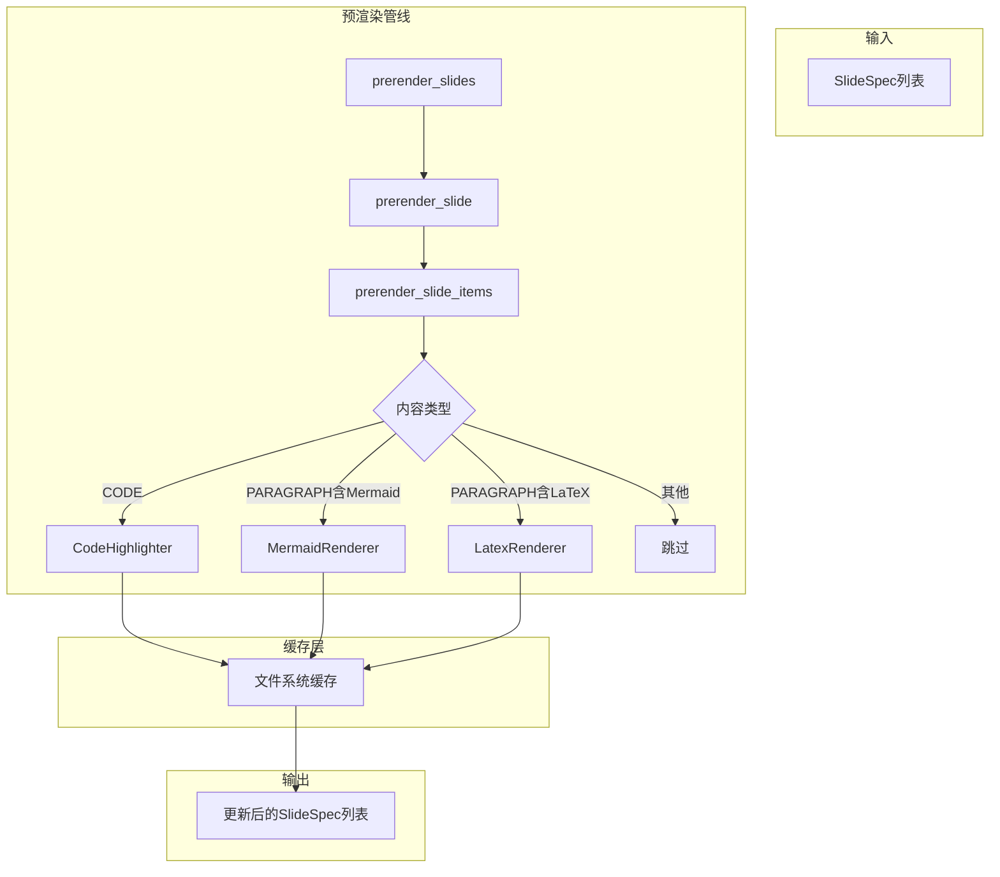

# 预渲染管线模块文档

## 1. 概述

预渲染管线是PPT-Generator的核心扩展模块，负责处理复杂内容的图片预渲染。将代码高亮、Mermaid图表、LaTeX公式等无法直接在PPT中完美展示的内容转换为高质量图片，再插入到幻灯片中。

## 2. 架构设计

### 2.1 整体架构图



### 2.2 数据模型

预渲染涉及两个核心数据模型：

```python
@dataclass(frozen=True)
class PrerenderResult:
    image_path: Path      # 生成的图片路径
    width: int            # 图片宽度（像素）
    height: int           # 图片高度（像素）
    content_hash: str     # 内容哈希，用于缓存
    
@dataclass(frozen=True)
class PrerenderConfig:
    enable_code: bool     # 是否启用代码高亮
    enable_mermaid: bool  # 是否启用Mermaid渲染
    enable_latex: bool    # 是否启用LaTeX渲染
    cache_dir: Path       # 缓存目录
    dpi: int              # 输出图片分辨率
    timeout: int          # 渲染超时时间（秒）
```

## 3. 预渲染器

### 3.1 CodeHighlighter

代码块语法高亮预渲染器，使用Pygments库生成带样式的PNG图片。

**定义位置**: [code_highlight.py](file:///C:/Users/frank/Documents/PPT-Generator/src/ppt_generator/prerendering/code_highlight.py)

**支持的语言**: Python、JavaScript、Java、C++、Go、Rust、SQL等数百种编程语言。

**配置项**:

| 配置项 | 类型 | 默认值 | 说明 |
|--------|------|--------|------|
| font | str | "Consolas" | 代码字体 |
| font_size | int | 11 | 字体大小（磅） |
| theme | str | "monokai" | 代码高亮主题 |
| line_numbers | bool | true | 是否显示行号 |
| background_color | str | "#272822" | 背景颜色 |
| text_color | str | "#F8F8F2" | 文本颜色 |
| padding | int | 12 | 内边距（像素） |

**使用示例**:

```python
from ppt_generator.prerendering import CodeHighlighter, PrerenderConfig
from ppt_generator.core.models import CodeStyle

style = CodeStyle(font="Consolas", font_size=11, theme="monokai")
config = PrerenderConfig()
renderer = CodeHighlighter(config, style)

result = renderer.prerender("def hello():\n    print('Hello')", "python")
```

### 3.2 MermaidRenderer

Mermaid图表预渲染器，支持mmdc命令行工具和Playwright两种渲染方式。

**定义位置**: [mermaid_renderer.py](file:///C:/Users/frank/Documents/PPT-Generator/src/ppt_generator/prerendering/mermaid_renderer.py)

**渲染方式检测**:

1. **mmdc**: 优先检测系统中是否安装了`mmdc`命令行工具
2. **playwright**: 如果mmdc不可用，尝试使用Playwright浏览器渲染
3. **fallback**: 如果都不可用，跳过渲染

**支持的图表类型**:

| 图表类型 | 关键字 | 用途 |
|----------|--------|------|
| 流程图 | `graph`, `flowchart` | 流程可视化 |
| 时序图 | `sequenceDiagram` | 交互流程 |
| 类图 | `classDiagram` | 面向对象设计 |
| 状态图 | `stateDiagram` | 状态机 |
| 甘特图 | `gantt` | 项目进度 |
| 饼图 | `pie` | 数据分布 |
| ER图 | `erDiagram` | 数据库设计 |
| 旅程图 | `journey` | 用户旅程 |

**配置项**:

| 配置项 | 类型 | 默认值 | 说明 |
|--------|------|--------|------|
| theme | str | "dark" | Mermaid主题 |
| background_color | str | "#1a1a1a" | 背景颜色 |
| scale | int | 2 | 缩放比例 |
| padding | int | 10 | 内边距（像素） |

**使用示例**:

```python
from ppt_generator.prerendering import MermaidRenderer, PrerenderConfig
from ppt_generator.core.models import MermaidStyle

style = MermaidStyle(theme="dark", scale=2)
config = PrerenderConfig()
renderer = MermaidRenderer(config, style)

result = renderer.prerender("graph TD\n    A --> B\n    B --> C")
```

### 3.3 LatexRenderer

LaTeX公式预渲染器，使用matplotlib渲染数学公式。

**定义位置**: [latex_renderer.py](file:///C:/Users/frank/Documents/PPT-Generator/src/ppt_generator/prerendering/latex_renderer.py)

**支持的公式格式**:

| 格式 | 示例 | 说明 |
|------|------|------|
| 行内公式 | `$E=mc^2$` | 单行公式 |
| 块级公式 | `$$\sum_{i=1}^{n} i$$` | 多行公式 |
| 标准LaTeX | `\[x^2 + y^2 = z^2\]` | LaTeX标准格式 |

**配置项**:

| 配置项 | 类型 | 默认值 | 说明 |
|--------|------|--------|------|
| font_size | int | 14 | 字体大小（磅） |
| background_color | str | "transparent" | 背景颜色 |
| dpi | int | 300 | 分辨率 |
| color | str | "#333333" | 文本颜色 |

**使用示例**:

```python
from ppt_generator.prerendering import LatexRenderer, PrerenderConfig
from ppt_generator.core.models import LatexStyle

style = LatexStyle(font_size=14, background_color="transparent")
config = PrerenderConfig()
renderer = LatexRenderer(config, style)

result = renderer.prerender("E=mc^2")
```

## 4. 管线组合器

### 4.1 prerender_slides

**定义位置**: [pipeline.py#L49-L65](file:///C:/Users/frank/Documents/PPT-Generator/src/ppt_generator/prerendering/pipeline.py#L49-L65)

对幻灯片列表执行预渲染。

```python
def prerender_slides(
    slides: list[SlideSpec],
    style_config: StyleConfig,
    prerender_config: PrerenderConfig | None = None,
) -> list[SlideSpec]:
```

**参数**:

| 参数 | 类型 | 说明 |
|------|------|------|
| slides | list[SlideSpec] | 幻灯片规格列表 |
| style_config | StyleConfig | 样式配置 |
| prerender_config | PrerenderConfig | 预渲染配置，可选 |

**返回**: 更新后的幻灯片规格列表，包含预渲染结果。

### 4.2 prerender_slide

**定义位置**: [pipeline.py#L68-L88](file:///C:/Users/frank/Documents/PPT-Generator/src/ppt_generator/prerendering/pipeline.py#L68-L88)

对单个幻灯片执行预渲染。

```python
def prerender_slide(
    slide: SlideSpec,
    style_config: StyleConfig,
    prerender_config: PrerenderConfig,
) -> SlideSpec:
```

**返回**: 更新后的幻灯片规格，预渲染结果存储在SlideItem的meta中。

### 4.3 prerender_slide_items

**定义位置**: [pipeline.py#L91-L107](file:///C:/Users/frank/Documents/PPT-Generator/src/ppt_generator/prerendering/pipeline.py#L91-L107)

对幻灯片内容项列表执行预渲染。

```python
def prerender_slide_items(
    items: list[SlideItem],
    style_config: StyleConfig,
    prerender_config: PrerenderConfig,
) -> list[SlideItem]:
```

## 5. 缓存机制

### 5.1 缓存策略

预渲染管线采用内容哈希缓存策略：

1. **计算哈希**: 对内容和语言（或类型）计算SHA-256哈希
2. **查找缓存**: 根据哈希查找缓存文件
3. **命中缓存**: 如果缓存存在，直接返回缓存结果
4. **未命中**: 执行渲染并保存到缓存目录

### 5.2 缓存目录结构

```
.cache/prerender/
├── code/              # 代码高亮缓存
│   ├── abc123.png
│   └── def456.png
├── mermaid/           # Mermaid图表缓存
│   └── ghi789.png
└── latex/             # LaTeX公式缓存
    └── jkl012.png
```

### 5.3 缓存管理

**清除缓存**:

```python
from ppt_generator.prerendering import clear_cache, PrerenderConfig

config = PrerenderConfig(cache_dir=Path(".cache/prerender"))
clear_cache(config)
```

**获取缓存统计**:

```python
stats = get_cache_stats(config)
# 返回: {"code": 5, "mermaid": 3, "latex": 2}
```

## 6. 设计原则

### 6.1 纯函数式

预渲染管线不修改输入数据，而是返回新的SlideSpec列表，确保数据不可变性。

### 6.2 可配置

通过`PrerenderConfig`可以灵活启用或禁用特定预渲染器：

```python
config = PrerenderConfig(
    enable_code=True,
    enable_mermaid=False,  # 禁用Mermaid渲染
    enable_latex=True,
)
```

### 6.3 缓存优先

相同内容只渲染一次，大幅提高重复生成的性能。

### 6.4 优雅降级

如果预渲染失败（如缺少依赖），保持原始内容不变，不影响整体生成流程。

## 7. 集成方式

### 7.1 在生成流程中集成

预渲染管线已集成到`build_slide_specs`函数中：

```python
from ppt_generator.core.generator import build_slide_specs

result = build_slide_specs(
    markdown_text,
    layouts,
    style_config,
    prerender_config=PrerenderConfig(),
)
```

### 7.2 通过PPTGenerator类

```python
from ppt_generator import PPTGenerator
from ppt_generator.core.models import PrerenderConfig

generator = PPTGenerator(
    markdown_text=open("input.md").read(),
    template_path=Path("template.pptx"),
    output_path=Path("output.pptx"),
    prerender_config=PrerenderConfig(),
)
generator.generate()
```

## 8. 依赖要求

### 8.1 代码高亮

- **pygments**: 语法高亮库（已包含在依赖中）

### 8.2 Mermaid渲染

**mmdc方式**（推荐）:
- 安装Node.js
- 安装Mermaid CLI: `npm install -g @mermaid-js/mermaid-cli`

**Playwright方式**:
- 安装playwright: `pip install playwright`
- 安装浏览器: `playwright install`

### 8.3 LaTeX渲染

- **matplotlib**: 数学公式渲染（已包含在依赖中）
- 建议安装LaTeX发行版以获得完整的数学符号支持

## 9. 性能优化

### 9.1 缓存机制

启用缓存后，重复生成相同内容的幻灯片时，预渲染步骤几乎为零开销。

### 9.2 并行渲染

预渲染管线设计为可并行化，未来可扩展为多进程并行渲染。

### 9.3 按需渲染

只对需要预渲染的内容项执行渲染，跳过普通文本段落。