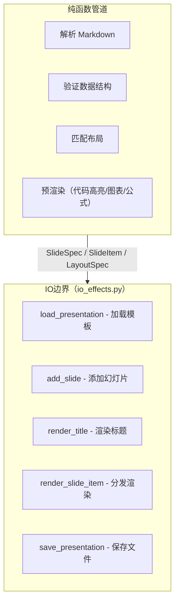
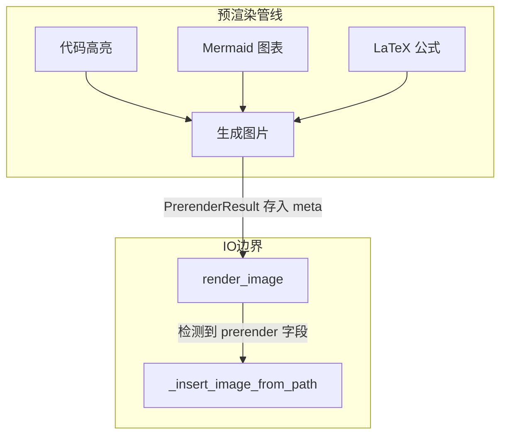
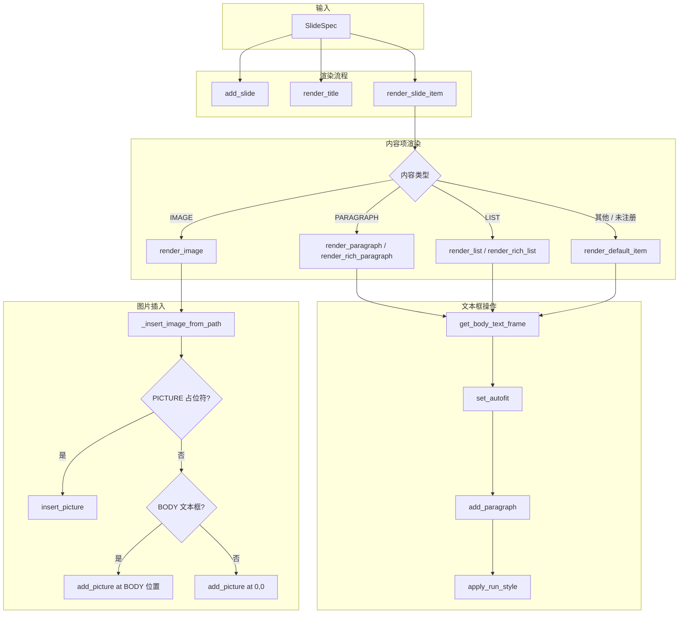
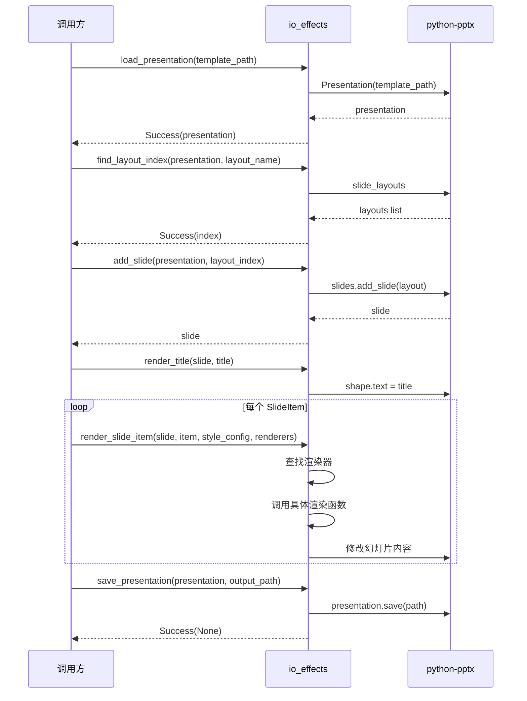

# 渲染模块文档

## 1. 概述

渲染模块是 PPT-Generator 的 IO 边界层，负责所有与 python-pptx 相关的可变操作。该模块实现了纯计算逻辑与副作用操作的彻底分离，确保核心业务逻辑的可测试性和可维护性。

### 1.1 IO 边界分离

本模块收敛所有与 python-pptx 相关的可变操作，实现 IO 边界分离。所有对外部世界的修改（文件读写、状态变更）都放在这里，纯计算逻辑在其他模块中，通过数据传递与本模块交互。

### 1.2 Result 类型

所有 IO 操作使用 `Result` 类型返回错误，避免抛出异常。`Result` 类型有两种状态：
- `Success(value)`：操作成功，包含结果值
- `Failure(error)`：操作失败，包含错误对象

### 1.3 设计原则

1. **IO 边界分离**：所有副作用操作集中在本模块
2. **纯函数优先**：纯计算逻辑与副作用分离
3. **Result 错误处理**：使用 Result 类型处理 IO 错误，避免抛出异常
4. **策略模式**：通过渲染器注册表实现内容类型的动态分发

---

## 2. 架构设计

### 2.1 纯函数与 IO 分离图



### 2.2 模块职责划分

| 模块 | 职责 | 特点 |
|------|------|------|
| 纯函数管道 | 解析、验证、匹配、预渲染 | 无副作用，可测试 |
| io_effects | 加载模板、渲染幻灯片、保存文件 | 纯副作用，不返回业务数据 |

---

## 3. 核心函数

### 3.1 文件操作

#### load_presentation

**定义位置**: [io_effects.py:39-54](file:///C:/Users/frank/Documents/PPT-Generator/src/ppt_generator/rendering/io_effects.py#L39-L54)

```python
def load_presentation(template_path: Path) -> Result[Presentation, TemplateLoadError]:
```

**参数**:
- `template_path: Path` — 模板文件路径

**返回值**: `Success(Presentation)` 如果加载成功，`Failure(TemplateLoadError)` 否则

**功能说明**: 加载 PPT 模板文件。内部通过 `TemplateLoader` 加载，捕获所有异常并转换为 `Failure` 类型返回。

---

#### save_presentation

**定义位置**: [io_effects.py:57-72](file:///C:/Users/frank/Documents/PPT-Generator/src/ppt_generator/rendering/io_effects.py#L57-L72)

```python
def save_presentation(presentation: Presentation, output_path: Path) -> Result[None, Exception]:
```

**参数**:
- `presentation: Presentation` — Presentation 对象
- `output_path: Path` — 输出文件路径

**返回值**: `Success(None)` 如果保存成功，`Failure(Exception)` 否则

**功能说明**: 保存演示文稿到输出路径。自动创建输出目录（通过 `ensure_dir`），捕获所有异常并转换为 `Failure` 类型返回。

---

### 3.2 布局操作

#### find_layout_index

**定义位置**: [io_effects.py:75-91](file:///C:/Users/frank/Documents/PPT-Generator/src/ppt_generator/rendering/io_effects.py#L75-L91)

```python
def find_layout_index(presentation: Presentation, layout_name: str) -> Result[int, ValueError]:
```

**参数**:
- `presentation: Presentation` — Presentation 对象
- `layout_name: str` — 布局名称

**返回值**: `Success(int)` 如果找到，`Failure(ValueError)` 否则

**功能说明**: 根据布局名称查找其在 `slide_layouts` 中的索引。使用生成器表达式遍历所有布局，找到第一个匹配名称的索引。

---

#### add_slide

**定义位置**: [io_effects.py:94-104](file:///C:/Users/frank/Documents/PPT-Generator/src/ppt_generator/rendering/io_effects.py#L94-L104)

```python
def add_slide(presentation: Presentation, layout_index: int) -> Slide:
```

**参数**:
- `presentation: Presentation` — Presentation 对象
- `layout_index: int` — 布局索引

**返回值**: 新创建的 `Slide` 对象

**功能说明**: 向演示文稿中添加一张新幻灯片，使用指定索引的布局。

---

#### extract_layouts

**定义位置**: [io_effects.py:346-361](file:///C:/Users/frank/Documents/PPT-Generator/src/ppt_generator/rendering/io_effects.py#L346-L361)

```python
def extract_layouts(template_path: Path) -> Result[list[LayoutSpec], TemplateLoadError]:
```

**参数**:
- `template_path: Path` — 模板文件路径

**返回值**: `Success(list[LayoutSpec])` 如果提取成功，`Failure(TemplateLoadError)` 否则

**功能说明**: 从演示文稿中提取所有布局信息。内部委托给 `TemplateLoader.list_layouts()` 方法。

---

### 3.3 标题渲染

#### render_title

**定义位置**: [io_effects.py:107-135](file:///C:/Users/frank/Documents/PPT-Generator/src/ppt_generator/rendering/io_effects.py#L107-L135)

```python
def render_title(slide: Slide, title: str) -> None:
```

**参数**:
- `slide: Slide` — Slide 对象
- `title: str` — 标题文本

**返回值**: 无

**功能说明**: 渲染幻灯片标题。采用两级匹配策略：

1. **第一优先级**：匹配 `TITLE` 或 `CENTER_TITLE` 类型的占位符
2. **第二优先级**：匹配名称包含 "title" 且不是 `SUBTITLE` 类型的占位符

优先匹配 TITLE 和 CENTER_TITLE 类型的占位符，避免匹配 SUBTITLE。

---

### 3.4 文本框操作

#### _find_first_placeholder

**定义位置**: [io_effects.py:138-160](file:///C:/Users/frank/Documents/PPT-Generator/src/ppt_generator/rendering/io_effects.py#L138-L160)

```python
def _find_first_placeholder(slide: Slide, ph_types: tuple[PP_PLACEHOLDER_TYPE, ...]) -> Any | None:
```

**参数**:
- `slide: Slide` — Slide 对象
- `ph_types: tuple[PP_PLACEHOLDER_TYPE, ...]` — 占位符类型元组，按优先级排序

**返回值**: `TextFrame` 对象，如果找不到则返回 `None`

**功能说明**: 按类型优先级查找第一个匹配的占位符文本框。这是一个高阶辅助函数，消除了 `get_body_text_frame` 中的重复循环逻辑。遍历 `ph_types` 中的每个类型，找到第一个匹配且具有文本框的占位符。

> **设计说明**：这是一个典型的高阶函数设计，将"查找占位符"的通用逻辑抽象出来，调用者只需传入类型优先级元组即可。这种设计避免了在多个函数中重复编写相似的循环查找代码。

---

#### get_body_text_frame

**定义位置**: [io_effects.py:163-178](file:///C:/Users/frank/Documents/PPT-Generator/src/ppt_generator/rendering/io_effects.py#L163-L178)

```python
def get_body_text_frame(slide: Slide) -> Any | None:
```

**参数**:
- `slide: Slide` — Slide 对象

**返回值**: `TextFrame` 对象，如果找不到则返回 `None`

**功能说明**: 获取幻灯片的正文文本框。按优先级查找：`BODY` > `OBJECT` > `SUBTITLE`。内部调用 `_find_first_placeholder` 高阶函数实现。

---

#### set_autofit

**定义位置**: [io_effects.py:181-187](file:///C:/Users/frank/Documents/PPT-Generator/src/ppt_generator/rendering/io_effects.py#L181-L187)

```python
def set_autofit(text_frame: Any) -> None:
```

**参数**:
- `text_frame: Any` — TextFrame 对象

**返回值**: 无

**功能说明**: 设置文本框自动调整大小模式为 `TEXT_TO_FIT_SHAPE`，使文本自动适应形状大小。

---

### 3.5 段落渲染

#### render_paragraph

**定义位置**: [io_effects.py:260-278](file:///C:/Users/frank/Documents/PPT-Generator/src/ppt_generator/rendering/io_effects.py#L260-L278)

```python
def render_paragraph(slide: Slide, content: str, append: bool = True) -> None:
```

**参数**:
- `slide: Slide` — Slide 对象
- `content: str` — 段落文本
- `append: bool = True` — 是否追加到现有内容，默认为 True

**返回值**: 无

**功能说明**: 渲染普通段落内容。自动启用 TextFrame 的 AutoFit 功能。如果 `append` 为 False 或文本框为空，则先清空文本框再添加段落。

---

#### render_rich_paragraph

**定义位置**: [io_effects.py:213-257](file:///C:/Users/frank/Documents/PPT-Generator/src/ppt_generator/rendering/io_effects.py#L213-L257)

```python
def render_rich_paragraph(
    slide: Slide,
    runs: list[RichRun],
    style_config: StyleConfig,
    append: bool = True,
) -> None:
```

**参数**:
- `slide: Slide` — Slide 对象
- `runs: list[RichRun]` — RichRun 列表
- `style_config: StyleConfig` — 样式配置
- `append: bool = True` — 是否追加到现有内容，默认为 True

**返回值**: 无

**功能说明**: 渲染带样式的段落内容。支持的富文本样式：

| 样式 | 说明 | 样式覆盖来源 |
|------|------|-------------|
| `bold` | 加粗文本 | `style_config.run_overrides.bold` |
| `italic` | 斜体文本 | `style_config.run_overrides.italic` |
| `code` | 行内代码 | `style_config.run_overrides.code` |
| `strikethrough` | 删除线 | 直接设置 |
| `link` | 链接 | `style_config.run_overrides.link` |

---

#### render_default_item

**定义位置**: [io_effects.py:382-395](file:///C:/Users/frank/Documents/PPT-Generator/src/ppt_generator/rendering/io_effects.py#L382-L395)

```python
def render_default_item(slide: Slide, item: SlideItem, style_config: StyleConfig) -> None:
```

**参数**:
- `slide: Slide` — Slide 对象
- `item: SlideItem` — 内容项对象
- `style_config: StyleConfig` — 样式配置

**返回值**: 无

**功能说明**: 默认内容项渲染器。作为 `render_slide_item` 的兜底渲染器。

逻辑：
1. 如果 `item.meta` 包含 `runs` 字段，使用 `render_rich_paragraph` 渲染
2. 否则，使用 `render_paragraph` 渲染普通文本

---

### 3.6 列表渲染

#### render_list

**定义位置**: [io_effects.py:281-300](file:///C:/Users/frank/Documents/PPT-Generator/src/ppt_generator/rendering/io_effects.py#L281-L300)

```python
def render_list(slide: Slide, content: str, level: int = 1) -> None:
```

**参数**:
- `slide: Slide` — Slide 对象
- `content: str` — 列表项内容
- `level: int = 1` — 列表级别（0 为顶级）

**返回值**: 无

**功能说明**: 渲染普通列表内容。自动启用 AutoFit 功能。如果文本框为空则先清空。每个列表项设置对应的缩进级别。

---

#### render_rich_list

**定义位置**: [io_effects.py:303-343](file:///C:/Users/frank/Documents/PPT-Generator/src/ppt_generator/rendering/io_effects.py#L303-L343)

```python
def render_rich_list(
    slide: Slide,
    items: list[list[RichRun]],
    style_config: StyleConfig,
    level: int = 1,
) -> None:
```

**参数**:
- `slide: Slide` — Slide 对象
- `items: list[list[RichRun]]` — 每个列表项的 RichRun 列表
- `style_config: StyleConfig` — 样式配置
- `level: int = 1` — 列表级别（0 为顶级）

**返回值**: 无

**功能说明**: 渲染带样式的列表内容。支持的样式与 `render_rich_paragraph` 相同（bold、italic、code）。每个列表项可以包含多个 RichRun，实现同一列表项内的多样式文本。

---

### 3.7 图片渲染

#### render_image

**定义位置**: [io_effects.py:398-415](file:///C:/Users/frank/Documents/PPT-Generator/src/ppt_generator/rendering/io_effects.py#L398-L415)

```python
def render_image(slide: Slide, item: SlideItem, style_config: StyleConfig | None = None) -> None:
```

**参数**:
- `slide: Slide` — Slide 对象
- `item: SlideItem` — 内容项对象
- `style_config: StyleConfig | None = None` — 样式配置（可选）

**返回值**: 无

**功能说明**: 渲染图片内容项。渲染优先级：

1. **预渲染图片**：如果 `item.meta` 包含 `prerender` 字段（`PrerenderResult` 类型），使用预渲染图片
2. **本地图片**：如果 `item.meta` 包含 `src` 字段且文件存在，使用该图片
3. **文本回退**：否则，回退到渲染文本内容（`item.content`）

---

#### _insert_image_from_path

**定义位置**: [io_effects.py:418-440](file:///C:/Users/frank/Documents/PPT-Generator/src/ppt_generator/rendering/io_effects.py#L418-L440)

```python
def _insert_image_from_path(slide: Slide, image_path: Path) -> None:
```

**参数**:
- `slide: Slide` — Slide 对象
- `image_path: Path` — 图片文件路径

**返回值**: 无

**功能说明**: 从文件路径插入图片到幻灯片。插入策略：

1. **PICTURE 占位符**：如果幻灯片有 PICTURE 类型的占位符，插入到占位符位置
2. **BODY 文本框位置**：如果没有 PICTURE 占位符，使用 BODY 文本框的位置和尺寸
3. **默认位置**：如果都找不到，插入到幻灯片左上角 (0, 0)

---

### 3.8 样式应用

#### apply_run_style

**定义位置**: [io_effects.py:190-210](file:///C:/Users/frank/Documents/PPT-Generator/src/ppt_generator/rendering/io_effects.py#L190-L210)

```python
def apply_run_style(run: Any, run_style: RunStyle) -> None:
```

**参数**:
- `run: Any` — python-pptx Run 对象
- `run_style: RunStyle` — Run 样式配置

**返回值**: 无

**功能说明**: 应用 Run 级别样式覆盖。仅当样式属性不为 `None` 时才应用，避免覆盖默认值。

支持的样式属性：

| 属性 | 类型 | 说明 |
|------|------|------|
| `font` | `str` | 字体名称 |
| `font_size` | `int` | 字体大小（磅） |
| `color` | `str` | 文本颜色（十六进制） |
| `bold` | `bool` | 是否加粗 |
| `italic` | `bool` | 是否斜体 |
| `underline` | `bool` | 是否下划线 |
| `background_color` | `str` | 背景高亮颜色 |

---

#### _hex_to_rgb

**定义位置**: [io_effects.py:443-453](file:///C:/Users/frank/Documents/PPT-Generator/src/ppt_generator/rendering/io_effects.py#L443-L453)

```python
def _hex_to_rgb(hex_color: str) -> RGBColor:
```

**参数**:
- `hex_color: str` — 十六进制颜色字符串，如 `"#FF0000"`

**返回值**: `RGBColor` 对象

**功能说明**: 将十六进制颜色转换为 python-pptx 的 `RGBColor` 对象。内部委托给 `..utils.hex_to_rgb` 工具函数。

---

### 3.9 内容项分发

#### render_slide_item

**定义位置**: [io_effects.py:364-379](file:///C:/Users/frank/Documents/PPT-Generator/src/ppt_generator/rendering/io_effects.py#L364-L379)

```python
def render_slide_item(
    slide: Slide,
    item: SlideItem,
    style_config: StyleConfig,
    renderers: dict[SlideItemType, Callable[[Slide, SlideItem, StyleConfig], None]],
) -> None:
```

**参数**:
- `slide: Slide` — Slide 对象
- `item: SlideItem` — 内容项对象
- `style_config: StyleConfig` — 样式配置
- `renderers: dict[SlideItemType, Callable]` — 渲染器注册表

**返回值**: 无

**功能说明**: 根据内容类型渲染幻灯片内容项。通过渲染器注册表（策略模式）查找对应的渲染函数。如果找不到对应类型的渲染器，则使用 `render_default_item` 作为兜底。

> **设计说明**：这是策略模式的典型应用。`renderers` 字典将 `SlideItemType` 枚举映射到具体的渲染函数，使得添加新的内容类型只需注册新的渲染器，无需修改本函数代码。

---

## 4. 关键设计模式

### 4.1 _find_first_placeholder 高阶函数

#### 设计动机

在早期实现中，`get_body_text_frame` 等函数包含重复的三重 for 循环逻辑，用于按优先级查找不同类型的占位符。这种设计存在以下问题：

- 代码重复：多个函数包含相似的循环查找逻辑
- 难以维护：修改查找逻辑需要改动多处
- 扩展性差：添加新的优先级类型需要修改循环结构

#### 解决方案

`_find_first_placeholder` 将"按优先级查找占位符"的通用逻辑抽象为高阶函数，调用者只需传入类型优先级元组：

```python
def _find_first_placeholder(slide, ph_types):
    for ph_type in ph_types:
        shape = next(
            (s for s in slide.shapes
             if s.is_placeholder
             and s.placeholder_format.type == ph_type
             and s.has_text_frame),
            None,
        )
        if shape is not None:
            return shape.text_frame
    return None
```

#### 使用方式

```python
def get_body_text_frame(slide):
    return _find_first_placeholder(slide, (
        PP_PLACEHOLDER_TYPE.BODY,
        PP_PLACEHOLDER_TYPE.OBJECT,
        PP_PLACEHOLDER_TYPE.SUBTITLE,
    ))
```

#### 设计收益

- **消除重复**：所有占位符查找逻辑集中在一处
- **声明式配置**：调用者只需声明优先级元组，无需关心查找细节
- **易于扩展**：添加新的查找函数只需定义新的优先级元组
- **可测试性**：高阶函数可以独立测试

---

### 4.2 render_slide_item 策略分发

#### 设计动机

幻灯片内容项有多种类型（段落、列表、图片、代码、表格等），每种类型的渲染逻辑不同。如果使用 if-elif 链或 match 语句，会导致：

- 函数体庞大，难以维护
- 添加新类型需要修改核心分发逻辑
- 违反开闭原则

#### 解决方案

`render_slide_item` 采用策略模式，通过渲染器注册表实现动态分发：

```python
def render_slide_item(slide, item, style_config, renderers):
    renderer = renderers.get(item.type, render_default_item)
    renderer(slide, item, style_config)
```

#### 渲染器注册表

渲染器注册表在调用方（如 `generator.py`）中定义，是一个 `dict[SlideItemType, Callable]`：

```python
RENDERERS = {
    SlideItemType.PARAGRAPH: render_paragraph_wrapper,
    SlideItemType.LIST: render_list_wrapper,
    SlideItemType.IMAGE: render_image,
    # ...
}
```

#### 兜底机制

如果内容类型不在注册表中，使用 `render_default_item` 作为兜底，确保不会抛出异常，而是降级为文本渲染。

#### 设计收益

- **开闭原则**：添加新类型只需注册新的渲染器，无需修改分发逻辑
- **单一职责**：每个渲染函数只负责一种内容类型
- **可测试性**：每个渲染器可以独立测试
- **灵活性**：可以在运行时动态替换或添加渲染器

---

## 5. 与预渲染管线的集成

### 5.1 预渲染流程概述

预渲染管线负责处理需要生成图片的内容（代码高亮、Mermaid 图表、LaTeX 公式），将其转换为图片文件后，再由渲染模块插入到幻灯片中。

### 5.2 PrerenderResult 数据结构

预渲染管线生成的结果通过 `PrerenderResult` 类型传递：

```python
@dataclass
class PrerenderResult:
    image_path: Path
    width: int
    height: int
    content_hash: str
```

### 5.3 数据传递方式

预渲染结果存储在 `SlideItem.meta` 字典的 `prerender` 字段中：

```python
item = SlideItem(
    type=SlideItemType.CODE,
    content="def hello(): ...",
    meta={
        "language": "python",
        "prerender": PrerenderResult(
            image_path=Path(".cache/prerender/code/abc123.png"),
            width=206,
            height=31,
            content_hash="abc123",
        ),
    },
)
```

### 5.4 渲染时的处理

`render_image` 函数检测到 `prerender` 字段时，会调用 `_insert_image_from_path` 将预渲染生成的图片插入到幻灯片中。

检测逻辑（io_effects.py:406-409）：

```python
prerender = item.meta.get("prerender")
if isinstance(prerender, PrerenderResult):
    _insert_image_from_path(slide, prerender.image_path)
    return
```

### 5.5 集成架构图



---

## 6. 数据流

### 6.1 渲染流程图



### 6.2 完整渲染数据流


