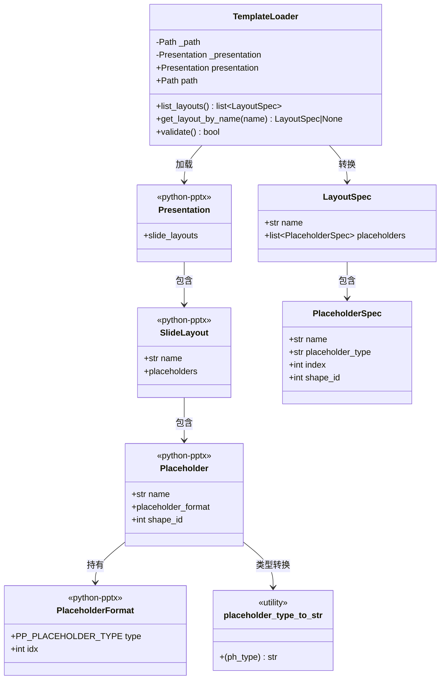
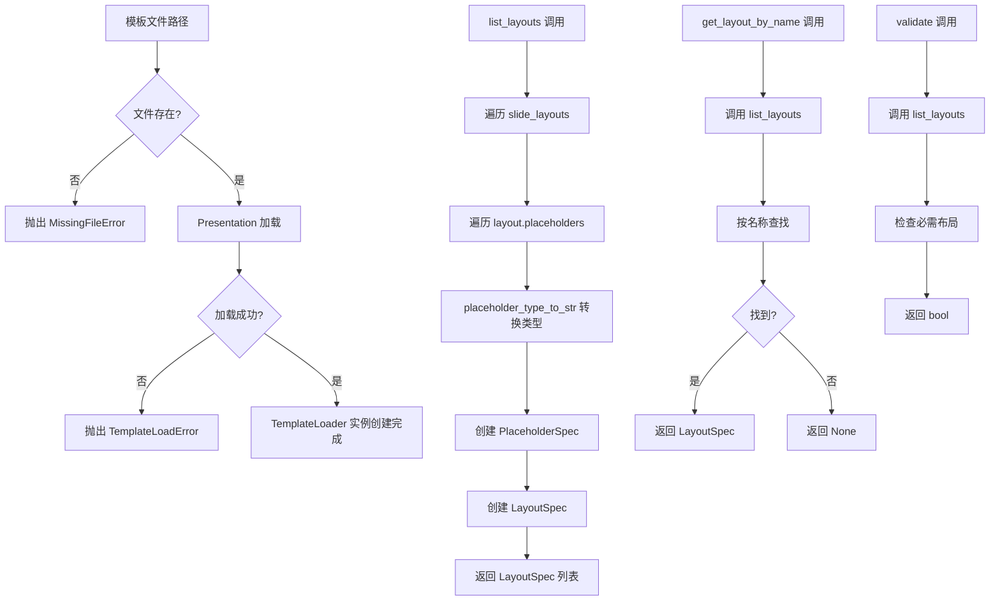

# 模板加载器开发文档

## 1. 概述

本模块负责加载和验证PPT模板文件，提取布局占位符元数据。使用 `python-pptx` 库读取模板文件，将原始布局对象转换为 `LayoutSpec` 列表，为后续的布局匹配和内容渲染提供数据基础。

**源代码位置**: [src/ppt_generator/templates/template_loader.py](file:///C:/Users/frank/Documents/PPT-Generator/src/ppt_generator/templates/template_loader.py)

## 2. 加载器架构

### 2.1 模块架构图



### 2.2 加载流程图



## 3. TemplateLoader 类

**定义位置**: [template_loader.py#L18-L116](file:///C:/Users/frank/Documents/PPT-Generator/src/ppt_generator/templates/template_loader.py#L18-L116)

PPT模板加载器，负责加载PPT模板文件，并提供布局信息查询功能。

### 3.1 属性

| 属性 | 类型 | 可见性 | 说明 | 定义位置 |
|------|------|--------|------|----------|
| `_path` | `Path` | 私有 | 模板文件路径 | [template_loader.py#L34](file:///C:/Users/frank/Documents/PPT-Generator/src/ppt_generator/templates/template_loader.py#L34-L34) |
| `_presentation` | `Presentation` | 私有 | python-pptx 的 Presentation 对象 | [template_loader.py#L40](file:///C:/Users/frank/Documents/PPT-Generator/src/ppt_generator/templates/template_loader.py#L40-L40) |
| `presentation` | `Presentation` | 公有只读 | 获取 Presentation 对象（属性） | [template_loader.py#L44-L51](file:///C:/Users/frank/Documents/PPT-Generator/src/ppt_generator/templates/template_loader.py#L44-L51) |
| `path` | `Path` | 公有只读 | 获取模板文件路径（属性） | [template_loader.py#L53-L60](file:///C:/Users/frank/Documents/PPT-Generator/src/ppt_generator/templates/template_loader.py#L53-L60) |

### 3.2 方法汇总

| 方法 | 返回值 | 说明 | 定义位置 |
|------|--------|------|----------|
| `__init__(template_path)` | `-` | 初始化加载器，加载模板 | [template_loader.py#L24-L42](file:///C:/Users/frank/Documents/PPT-Generator/src/ppt_generator/templates/template_loader.py#L24-L42) |
| `list_layouts()` | `list[LayoutSpec]` | 列出模板中所有可用的布局 | [template_loader.py#L62-L82](file:///C:/Users/frank/Documents/PPT-Generator/src/ppt_generator/templates/template_loader.py#L62-L82) |
| `get_layout_by_name(name)` | `Optional[LayoutSpec]` | 根据名称获取布局 | [template_loader.py#L84-L96](file:///C:/Users/frank/Documents/PPT-Generator/src/ppt_generator/templates/template_loader.py#L84-L96) |
| `validate()` | `bool` | 验证模板是否符合标准规范 | [template_loader.py#L98-L116](file:///C:/Users/frank/Documents/PPT-Generator/src/ppt_generator/templates/template_loader.py#L98-L116) |

### 3.3 方法详细说明

#### 3.3.1 `__init__`

**定义位置**: [template_loader.py#L24-L42](file:///C:/Users/frank/Documents/PPT-Generator/src/ppt_generator/templates/template_loader.py#L24-L42)

初始化模板加载器，加载指定的PPT模板文件。

**参数**:

| 参数 | 类型 | 说明 |
|------|------|------|
| `template_path` | `Path \| str` | PPT模板文件路径 |

**异常**:

| 异常 | 触发条件 |
|------|----------|
| `MissingFileError` | 模板文件不存在 |
| `TemplateLoadError` | 模板无法加载 |

**处理逻辑**:
1. 将 `template_path` 转换为 `Path` 对象并赋值给 `self._path`
2. 检查文件是否存在，不存在则抛出 `MissingFileError`
3. 尝试使用 `Presentation` 加载模板文件
4. 加载失败则抛出 `TemplateLoadError`

#### 3.3.2 `list_layouts`

**定义位置**: [template_loader.py#L62-L82](file:///C:/Users/frank/Documents/PPT-Generator/src/ppt_generator/templates/template_loader.py#L62-L82)

列出模板中所有可用的布局及其占位符信息。

**返回值**: `list[LayoutSpec]` - 布局规格列表

**处理逻辑**:
1. 初始化空列表 `layouts`
2. 遍历 `self._presentation.slide_layouts` 中的每个布局
3. 对每个布局，遍历其 `placeholders` 集合
4. 为每个占位符创建 `PlaceholderSpec`，使用 `placeholder_type_to_str` 转换类型
5. 创建 `LayoutSpec` 并添加到结果列表
6. 返回完整的布局列表

#### 3.3.3 `get_layout_by_name`

**定义位置**: [template_loader.py#L84-L96](file:///C:/Users/frank/Documents/PPT-Generator/src/ppt_generator/templates/template_loader.py#L84-L96)

根据布局名称获取对应的布局规格。

**参数**:

| 参数 | 类型 | 说明 |
|------|------|------|
| `name` | `str` | 布局名称 |

**返回值**: `Optional[LayoutSpec]` - 找到的布局规格，找不到则返回 `None`

**处理逻辑**:
1. 调用 `self.list_layouts()` 获取所有布局
2. 遍历布局列表，比较名称
3. 找到匹配项则返回，否则返回 `None`

#### 3.3.4 `validate`

**定义位置**: [template_loader.py#L98-L116](file:///C:/Users/frank/Documents/PPT-Generator/src/ppt_generator/templates/template_loader.py#L98-L116)

验证模板是否符合标准规范，检查是否包含必需的布局。

**返回值**: `bool` - 模板有效返回 `True`，否则返回 `False`

**必需布局列表**:

| 布局名称 | 用途 |
|----------|------|
| `Title Slide` | 标题页布局 |
| `Title and Content` | 标题和内容布局 |
| `Section Header` | 节标题布局 |

**处理逻辑**:
1. 定义必需布局名称列表
2. 调用 `self.list_layouts()` 获取所有布局
3. 提取所有布局名称
4. 检查每个必需布局是否存在
5. 全部存在则返回 `True`，否则返回 `False`

## 4. 数据转换示例

### 4.1 输入输出示例

**输入**: PowerPoint 模板文件（.pptx）

**输出**:

```python
[
    LayoutSpec(
        name="Title Slide",
        placeholders=[
            PlaceholderSpec(
                name="Title 1",
                placeholder_type="title",
                index=0,
                shape_id=1
            ),
            PlaceholderSpec(
                name="Subtitle 1",
                placeholder_type="subtitle",
                index=1,
                shape_id=2
            )
        ]
    ),
    LayoutSpec(
        name="Title and Content",
        placeholders=[
            PlaceholderSpec(
                name="Title 1",
                placeholder_type="title",
                index=0,
                shape_id=3
            ),
            PlaceholderSpec(
                name="Content Placeholder 2",
                placeholder_type="body",
                index=1,
                shape_id=4
            )
        ]
    ),
    LayoutSpec(
        name="Section Header",
        placeholders=[
            PlaceholderSpec(
                name="Title 1",
                placeholder_type="title",
                index=0,
                shape_id=5
            ),
            PlaceholderSpec(
                name="Text Placeholder 2",
                placeholder_type="body",
                index=1,
                shape_id=6
            )
        ]
    )
]
```

### 4.2 转换对应关系

| python-pptx 对象 | 目标对象 | 转换方式 |
|------------------|----------|----------|
| `SlideLayout` | `LayoutSpec` | 遍历 `slide_layouts`，提取 `name` 和 `placeholders` |
| `Placeholder` | `PlaceholderSpec` | 提取 `name`、`shape_id`，通过 `placeholder_format` 获取 `type` 和 `idx` |
| `PP_PLACEHOLDER_TYPE` 枚举 | `str` | 通过 `placeholder_type_to_str` 函数转换 |

## 5. 占位符类型映射

### 5.1 `placeholder_type_to_str` 函数

**定义位置**: [src/ppt_generator/utils/__init__.py#L114-L136](file:///C:/Users/frank/Documents/PPT-Generator/src/ppt_generator/utils/__init__.py#L114-L136)

将 python-pptx 占位符类型枚举转换为字符串表示。

**参数**:

| 参数 | 类型 | 说明 |
|------|------|------|
| `ph_type` | `Any` | `PP_PLACEHOLDER_TYPE` 枚举值 |

**返回值**: `str` - 类型字符串，如 `"title"`、`"body"` 等

### 5.2 类型映射表

| PP_PLACEHOLDER_TYPE 枚举 | 字符串值 | 说明 |
|--------------------------|----------|------|
| `TITLE` | `"title"` | 标题占位符 |
| `CENTER_TITLE` | `"center_title"` | 居中标题占位符 |
| `SUBTITLE` | `"subtitle"` | 副标题占位符 |
| `BODY` | `"body"` | 正文占位符 |
| `OBJECT` | `"object"` | 对象占位符 |
| `PICTURE` | `"picture"` | 图片占位符 |
| `FOOTER` | `"footer"` | 页脚占位符 |
| `DATE` | `"date"` | 日期占位符 |
| `SLIDE_NUMBER` | `"slide_number"` | 幻灯片编号占位符 |
| 其他 | `"unknown_{type}"` | 未知类型 |

## 6. 数据模型与不可变性

### 6.1 LayoutSpec

**定义位置**: [src/ppt_generator/core/models.py#L161-L195](file:///C:/Users/frank/Documents/PPT-Generator/src/ppt_generator/core/models.py#L161-L195)

描述模板中可用的幻灯片布局及其占位符。使用 `@dataclass(frozen=True)` 确保不可变性。

**属性**:

| 属性 | 类型 | 说明 |
|------|------|------|
| `name` | `str` | 布局名称 |
| `placeholders` | `list[PlaceholderSpec]` | 占位符规格列表 |

**验证**:
- `name` 不能为空
- `placeholders` 中的每个元素必须是 `PlaceholderSpec` 实例

### 6.2 PlaceholderSpec

**定义位置**: [src/ppt_generator/core/models.py#L117-L158](file:///C:/Users/frank/Documents/PPT-Generator/src/ppt_generator/core/models.py#L117-L158)

描述模板布局中的占位符形状。使用 `@dataclass(frozen=True)` 确保不可变性。

**属性**:

| 属性 | 类型 | 说明 |
|------|------|------|
| `name` | `str` | 占位符名称 |
| `placeholder_type` | `str` | 占位符类型 |
| `index` | `int` | 占位符索引 |
| `shape_id` | `int` | PowerPoint 分配的形状 ID |

**验证**:
- `name` 不能为空
- `index` 必须是非负整数
- `shape_id` 必须是非负整数

### 6.3 不可变数据的优势

- **线程安全**: 不可变对象可以在多线程环境中安全共享
- **可预测性**: 数据状态不会意外改变，便于调试和推理
- **值语义**: 可以按值比较，作为字典键使用
- **防御式编程**: 防止外部代码意外修改内部状态

## 7. PowerPoint 模板结构说明

### 7.1 PPTX 文件结构

```
template.pptx
├── ppt/
│   ├── slideLayouts/
│   │   ├── slideLayout1.xml    # 标题页布局
│   │   ├── slideLayout2.xml    # 标题和内容布局
│   │   ├── slideLayout3.xml    # 节标题布局
│   │   └── ...
│   ├── slideMasters/
│   │   └── slideMaster1.xml    # 幻灯片母版
│   ├── theme/
│   │   └── theme1.xml          # 主题定义
│   └── presentation.xml        # 演示文稿主文件
├── [Content_Types].xml
└── _rels/
    └── .rels
```

### 7.2 标准布局类型

| 布局名称 | 典型占位符 | 用途 |
|----------|-----------|------|
| Title Slide | Title 1, Subtitle 1 | 演示文稿标题页 |
| Title and Content | Title 1, Content Placeholder 2 | 标题 + 正文内容 |
| Section Header | Title 1, Text Placeholder 2 | 章节分隔页 |
| Two Content | Title 1, Content Placeholder 2, Content Placeholder 3 | 双栏内容对比 |
| Comparison | Title 1, Content Placeholder 2, Content Placeholder 3 | 对比布局 |
| Title Only | Title 1 | 仅标题，自由内容 |
| Blank | 无 | 空白页，完全自定义 |
| Content with Caption | Title 1, Content Placeholder 2, Text Placeholder 3 | 内容配说明文字 |
| Picture with Caption | Title 1, Content Placeholder 2, Text Placeholder 3 | 图片配说明文字 |

### 7.3 占位符索引约定

在 PowerPoint 中，每个占位符都有一个索引（`idx`），用于在布局中唯一标识占位符的位置：

- 索引 `0`: 通常是标题占位符
- 索引 `1`: 通常是主要内容占位符
- 索引 `2+`: 其他内容占位符

这些索引在创建幻灯片时用于定位和填充内容。
