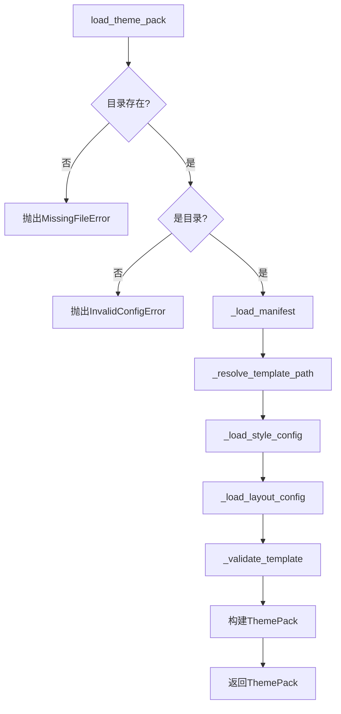
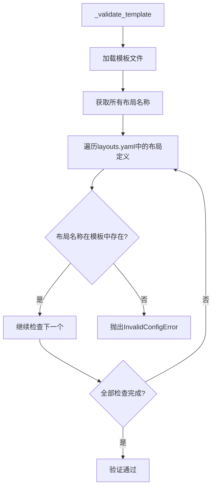

# 主题包模块文档

## 1. 概述

主题包模块提供 PPT-Generator 的主题系统支持，允许用户通过主题包切换不同的 PPT 样式和布局。主题包包含完整的母版模板、样式配置、布局定义和资源文件，实现了"一键换肤"功能。

**核心设计原则：语义与视觉分离**

- `layouts.yaml` 管语义：定义布局的语义角色、匹配规则和默认行为
- `template.pptx` 管视觉：定义布局的视觉样式、位置和格式

## 2. 主题包结构

### 2.1 目录结构

```
themes/
└── standard/                         # 主题包目录（主题名称）
    ├── manifest.yaml                 # 必需：主题元数据
    ├── layouts.yaml                  # 必需：布局语义定义
    ├── style.yaml                    # 必需：样式配置
    ├── template.pptx                 # 必需：PPT母版模板
    ├── preview.png                   # 可选：预览图
    ├── fonts/                        # 可选：字体文件目录
    │   ├── font1.ttf
    │   └── font2.ttf
    └── assets/                       # 可选：资源文件目录
        ├── logo.png
        └── background.jpg
```

### 2.2 必需文件说明

| 文件名 | 必需 | 说明 |
|--------|------|------|
| `manifest.yaml` | 是 | 主题包元数据，包含名称、版本、作者、文件映射等 |
| `layouts.yaml` | 是 | 布局语义定义，描述每个布局的角色、占位符和匹配规则 |
| `style.yaml` | 是 | 样式配置，定义代码、表格、Mermaid、LaTeX 等内容的样式 |
| `template.pptx` | 是 | PPT 母版模板，包含所有布局的视觉定义 |

### 2.3 可选文件说明

| 文件名/目录 | 说明 |
|------------|------|
| `preview.png` | 主题预览图 |
| `fonts/` | 自定义字体文件目录 |
| `assets/` | 资源文件目录（Logo、背景图等） |

## 3. 核心数据模型

### 3.1 ThemePack

主题包的完整定义。

**定义位置**: [models.py#L493-L505](file:///C:/Users/frank/Documents/PPT-Generator/src/ppt_generator/core/models.py#L493-L505)

```python
@dataclass(frozen=True)
class ThemePack:
    manifest: ThemePackManifest      # 主题元数据
    template_path: Path              # 模板文件路径
    style_config: StyleConfig        # 样式配置
    layout_config: LayoutConfig      # 布局配置
    preview_path: Path | None        # 预览图路径（可选）
    fonts_path: Path | None          # 字体目录路径（可选）
    assets_path: Path | None         # 资源目录路径（可选）
```

### 3.2 ThemePackManifest

主题包元数据。

**定义位置**: [models.py#L470-L489](file:///C:/Users/frank/Documents/PPT-Generator/src/ppt_generator/core/models.py#L470-L489)

```python
@dataclass(frozen=True)
class ThemePackManifest:
    name: str                        # 主题显示名称
    version: str                     # 版本号，遵循语义化版本
    author: str                      # 作者信息
    description: str | None          # 主题描述（可选）
    spec_version: str                # 规范版本，当前为1.0
    compatible_generator: str | None # 兼容的生成器版本（可选）
    files: dict[str, str]            # 文件路径映射
    preview: dict[str, str]          # 预览配置
    tags: list[str]                  # 标签列表，用于分类搜索
```

### 3.3 LayoutConfig

完整的布局配置，从 `layouts.yaml` 加载。

**定义位置**: [models.py#L396-L433](file:///C:/Users/frank/Documents/PPT-Generator/src/ppt_generator/core/models.py#L396-L433)

```python
@dataclass(frozen=True)
class LayoutConfig:
    version: str = "1.0"
    defaults: LayoutDefaults = field(default_factory=LayoutDefaults)
    groups: dict[str, LayoutGroupDef] = field(default_factory=dict)
    layouts: list[LayoutDef] = field(default_factory=list)
```

**主要方法**:

- `get_layout_by_name(name: str) -> LayoutDef | None` - 根据布局名称查找布局定义
- `get_layout_by_id(layout_id: str) -> LayoutDef | None` - 根据布局 ID 查找布局定义
- `get_default_layout_name(scenario: str = "default") -> str` - 获取指定场景的默认布局名称

### 3.4 LayoutDef

单个布局的完整定义。

**定义位置**: [models.py#L325-L356](file:///C:/Users/frank/Documents/PPT-Generator/src/ppt_generator/core/models.py#L325-L356)

```python
@dataclass(frozen=True)
class LayoutDef:
    id: str
    name: str
    display_name: str | None = None
    description: str | None = None
    group: str | None = None
    placeholders: list[LayoutPlaceholderDef] = field(default_factory=list)
    keywords: list[str] = field(default_factory=list)
    tags: list[str] = field(default_factory=list)
    auto_apply: LayoutAutoApply | None = None
```

**说明**: `template.pptx` 中的布局通过 `name` 字段与此定义关联。

### 3.5 LayoutDefaults

默认布局配置，定义各种场景下默认使用的布局 ID。

**定义位置**: [models.py#L374-L392](file:///C:/Users/frank/Documents/PPT-Generator/src/ppt_generator/core/models.py#L374-L392)

```python
@dataclass(frozen=True)
class LayoutDefaults:
    default: str = "title-and-content"
    first_slide: str = "title-slide"
    section_divider: str = "section-header"
    content: str = "title-and-content"
    multi_column: str = "two-content"
    media: str = "content-with-caption"
    image: str = "picture-with-caption"
    full_width: str = "blank"
```

### 3.6 StyleConfig

样式配置集合。

**定义位置**: [models.py#L437-L444](file:///C:/Users/frank/Documents/PPT-Generator/src/ppt_generator/core/models.py#L437-L444)

```python
@dataclass(frozen=True)
class StyleConfig:
    code: CodeStyle                  # 代码块样式
    mermaid: MermaidStyle            # Mermaid图表样式
    latex: LatexStyle                # LaTeX公式样式
    table: TableStyle                # 表格样式
    run_overrides: RunOverrides      # Run级别样式覆盖
```

### 3.7 CodeStyle

代码块样式配置。

**定义位置**: [models.py#L214-L225](file:///C:/Users/frank/Documents/PPT-Generator/src/ppt_generator/core/models.py#L214-L225)

```python
@dataclass(frozen=True)
class CodeStyle:
    font: str = "Consolas"
    font_size: int = 11
    theme: str = "monokai"
    line_numbers: bool = True
    background_color: str = "#272822"
    text_color: str = "#F8F8F2"
    border_radius: int = 4
    padding: int = 12
    line_height: float = 1.4
```

### 3.8 MermaidStyle

Mermaid 图表样式配置。

**定义位置**: [models.py#L229-L235](file:///C:/Users/frank/Documents/PPT-Generator/src/ppt_generator/core/models.py#L229-L235)

```python
@dataclass(frozen=True)
class MermaidStyle:
    theme: str = "dark"
    background_color: str = "#1a1a1a"
    scale: int = 2
    padding: int = 10
```

### 3.9 LatexStyle

LaTeX 公式样式配置。

**定义位置**: [models.py#L239-L245](file:///C:/Users/frank/Documents/PPT-Generator/src/ppt_generator/core/models.py#L239-L245)

```python
@dataclass(frozen=True)
class LatexStyle:
    font_size: int = 14
    background_color: str = "transparent"
    dpi: int = 300
    color: str = "#333333"
```

### 3.10 TableStyle

表格样式配置。

**定义位置**: [models.py#L249-L259](file:///C:/Users/frank/Documents/PPT-Generator/src/ppt_generator/core/models.py#L249-L259)

```python
@dataclass(frozen=True)
class TableStyle:
    font: str = "微软雅黑"
    font_size: int = 10
    header_background: str = "#4472C4"
    header_color: str = "#FFFFFF"
    even_row_background: str = "#F5F5F5"
    odd_row_background: str = "#FFFFFF"
    border_color: str = "#CCCCCC"
    border_width: int = 1
```

### 3.11 RunOverrides 和 RunStyle

Run 级别样式覆盖配置。

**定义位置**:
- RunOverrides: [models.py#L276-L282](file:///C:/Users/frank/Documents/PPT-Generator/src/ppt_generator/core/models.py#L276-L282)
- RunStyle: [models.py#L263-L272](file:///C:/Users/frank/Documents/PPT-Generator/src/ppt_generator/core/models.py#L263-L272)

```python
@dataclass(frozen=True)
class RunStyle:
    font: str | None = None
    font_size: int | None = None
    color: str | None = None
    bold: bool | None = None
    italic: bool | None = None
    underline: bool | None = None
    background_color: str | None = None

@dataclass(frozen=True)
class RunOverrides:
    bold: RunStyle                   # 加粗文本样式
    italic: RunStyle                 # 斜体文本样式
    code: RunStyle                   # 行内代码样式
    link: RunStyle                   # 链接样式
```

## 4. 核心函数

### 4.1 load_theme_pack

加载主题包。

**定义位置**: [theme_pack.py#L36-L77](file:///C:/Users/frank/Documents/PPT-Generator/src/ppt_generator/themes/theme_pack.py#L36-L77)

```python
def load_theme_pack(theme_pack_path: Path | str) -> ThemePack:
```

**参数**:
- `theme_pack_path`: 主题包目录路径

**返回**: `ThemePack` 实例

**异常**:
- `MissingFileError`: 如果主题包目录或必需文件不存在
- `InvalidConfigError`: 如果主题包配置无效
- `TemplateLoadError`: 如果模板验证失败

**加载流程**:



### 4.2 list_available_themes

列出指定目录下所有可用的主题包。

**定义位置**: [theme_pack.py#L326-L352](file:///C:/Users/frank/Documents/PPT-Generator/src/ppt_generator/themes/theme_pack.py#L326-L352)

```python
def list_available_themes(themes_dir: Path | str) -> list[ThemePackManifest]:
```

**参数**:
- `themes_dir`: 主题包存放目录

**返回**: 主题包元数据列表

**特性**: 跳过验证失败的主题包，不会抛出异常

### 4.3 extract_layouts

从模板文件提取布局规格。

**定义位置**: [io_effects.py#L346-L361](file:///C:/Users/frank/Documents/PPT-Generator/src/ppt_generator/rendering/io_effects.py#L346-L361)

```python
def extract_layouts(template_path: Path) -> Result[list[LayoutSpec], TemplateLoadError]:
```

**参数**:
- `template_path`: 模板文件路径

**返回**: `Result[list[LayoutSpec], TemplateLoadError]` - 布局规格列表或加载错误

**说明**: 此函数位于 `ppt_generator.rendering` 模块，用于从 PowerPoint 模板文件中提取布局信息。

## 5. 配置文件格式

### 5.1 manifest.yaml

主题包元数据配置文件。

**示例** (来自 standard 主题):

```yaml
name: "Standard"
version: "1.0.0"
author: "PPT-Generator Team"
description: "PPT-Generator 标准母版主题，蓝色系商务风格，适合大多数演示场景"
spec_version: "1.0"
compatible_generator: ">=1.0.0"

files:
  template: "template.pptx"
  style: "style.yaml"
  layouts: "layouts.yaml"
  preview: "preview.png"

preview:
  color: "#1F4E79"

tags:
  - "standard"
  - "business"
  - "blue"
  - "professional"
  - "default"
```

**字段说明**:

| 字段 | 类型 | 必需 | 说明 |
|------|------|------|------|
| `name` | string | 是 | 主题显示名称 |
| `version` | string | 是 | 版本号，遵循语义化版本 |
| `author` | string | 是 | 作者信息 |
| `description` | string | 否 | 主题描述 |
| `spec_version` | string | 否 | 规范版本，默认 `"1.0"` |
| `compatible_generator` | string | 否 | 兼容的生成器版本 |
| `files` | dict | 否 | 文件路径映射，可自定义文件名 |
| `files.template` | string | 否 | 模板文件名，默认 `"template.pptx"` |
| `files.style` | string | 否 | 样式配置文件名，默认 `"style.yaml"` |
| `files.layouts` | string | 否 | 布局配置文件名，默认 `"layouts.yaml"` |
| `files.preview` | string | 否 | 预览图文件名 |
| `preview` | dict | 否 | 预览配置 |
| `preview.color` | string | 否 | 主题代表色 |
| `tags` | list[string] | 否 | 标签列表，用于分类搜索 |

### 5.2 layouts.yaml

布局语义定义文件，是主题包的布局定义中心。

**核心设计：语义与视觉分离**

- `layouts.yaml` 定义布局的**语义**：每个布局的角色、占位符的用途、自动匹配规则
- `template.pptx` 定义布局的**视觉**：占位符的位置、大小、字体、颜色等视觉属性

**示例** (来自 standard 主题):

```yaml
version: "1.0"

defaults:
  default: "title-and-content"
  first_slide: "title-slide"
  section_divider: "section-header"
  content: "title-and-content"
  multi_column: "two-content"
  media: "content-with-caption"
  image: "picture-with-caption"
  full_width: "blank"

groups:
  title:
    display_name: "标题类"
    description: "用于封面、章节分隔、结束页"
  content:
    display_name: "内容类"
    description: "用于正文内容展示"
  media:
    display_name: "媒体类"
    description: "用于图片、图表等媒体内容"
  special:
    display_name: "特殊类"
    description: "空白页等特殊布局"

layouts:
  - id: "title-slide"
    name: "Title Slide"
    display_name: "标题幻灯片"
    description: "用于演示文稿封面、章节分隔、结束页"
    group: "title"
    placeholders:
      - index: 0
        type: "title"
        role: "main-title"
        name: "Title 1"
      - index: 1
        type: "subtitle"
        role: "subtitle"
        name: "Subtitle 2"
    keywords: ["标题", "封面", "title", "cover", "首页"]
    tags: ["title", "cover"]
    auto_apply:
      conditions: ["first_slide", "last_slide"]
      priority: 100
```

**字段说明**:

| 字段 | 类型 | 必需 | 说明 |
|------|------|------|------|
| `version` | string | 否 | 布局配置版本，默认 `"1.0"` |
| `defaults` | object | 否 | 默认布局配置 |
| `defaults.default` | string | 否 | 默认布局 ID，默认 `"title-and-content"` |
| `defaults.first_slide` | string | 否 | 首页布局 ID，默认 `"title-slide"` |
| `defaults.section_divider` | string | 否 | 章节分隔布局 ID，默认 `"section-header"` |
| `defaults.content` | string | 否 | 内容页布局 ID，默认 `"title-and-content"` |
| `defaults.multi_column` | string | 否 | 多栏布局 ID，默认 `"two-content"` |
| `defaults.media` | string | 否 | 媒体布局 ID，默认 `"content-with-caption"` |
| `defaults.image` | string | 否 | 图片布局 ID，默认 `"picture-with-caption"` |
| `defaults.full_width` | string | 否 | 全宽布局 ID，默认 `"blank"` |
| `groups` | object | 否 | 布局分组定义 |
| `layouts` | array | 是 | 布局定义列表 |

**LayoutDef 字段说明**:

| 字段 | 类型 | 必需 | 说明 |
|------|------|------|------|
| `id` | string | 是 | 布局唯一标识 |
| `name` | string | 是 | 布局名称，与 template.pptx 中的布局名称对应 |
| `display_name` | string | 否 | 显示名称 |
| `description` | string | 否 | 布局描述 |
| `group` | string | 否 | 所属分组 ID |
| `placeholders` | array | 否 | 占位符定义列表 |
| `keywords` | array | 否 | 关键词列表，用于布局匹配 |
| `tags` | array | 否 | 标签列表 |
| `auto_apply` | object | 否 | 自动应用规则 |

**LayoutPlaceholderDef 字段说明**:

| 字段 | 类型 | 必需 | 说明 |
|------|------|------|------|
| `index` | int | 是 | 占位符索引 |
| `type` | string | 是 | 占位符类型 |
| `role` | string | 否 | 语义角色 |
| `name` | string | 否 | 占位符名称 |
| `description` | string | 否 | 描述 |

**LayoutAutoApply 字段说明**:

| 字段 | 类型 | 必需 | 说明 |
|------|------|------|------|
| `conditions` | array | 否 | 触发条件列表 |
| `priority` | int | 否 | 优先级，默认 0 |

### 5.3 style.yaml

样式配置文件。

**示例** (来自 standard 主题):

```yaml
code:
  font: "Consolas"
  font_size: 11
  theme: "monokai"
  line_numbers: true
  background_color: "#272822"
  text_color: "#F8F8F2"
  border_radius: 4
  padding: 12
  line_height: 1.4

mermaid:
  theme: "default"
  background_color: "#FFFFFF"
  scale: 2
  padding: 10

latex:
  font_size: 14
  background_color: "transparent"
  dpi: 300
  color: "#1F4E79"

table:
  font: "微软雅黑"
  font_size: 10
  header_background: "#1F4E79"
  header_color: "#FFFFFF"
  even_row_background: "#F5F7FA"
  odd_row_background: "#FFFFFF"
  border_color: "#D0D7DE"
  border_width: 1

run_overrides:
  bold:
    color: "#1F4E79"
    font: "微软雅黑"
  italic:
    color: "#2E75B6"
    font: "微软雅黑"
  code:
    font: "Consolas"
    font_size: 10
    background_color: "#F5F7FA"
    color: "#C7254E"
  link:
    color: "#2E75B6"
    underline: true
    font: "微软雅黑"
```

## 6. 模板验证

### 6.1 验证逻辑

主题包加载时会验证模板文件，确保 `template.pptx` 中包含 `layouts.yaml` 定义的所有布局。

**定义位置**: [theme_pack.py#L304-L323](file:///C:/Users/frank/Documents/PPT-Generator/src/ppt_generator/themes/theme_pack.py#L304-L323)

**验证流程**:



**异常**: 如果模板缺少 `layouts.yaml` 中定义的任何布局，将抛出 `InvalidConfigError`。

### 6.2 standard 主题的布局列表

standard 主题包含以下 7 个布局：

| 布局 ID | 布局名称 | 显示名称 | 分组 |
|---------|---------|---------|------|
| `title-slide` | Title Slide | 标题幻灯片 | 标题类 |
| `title-and-content` | Title and Content | 标题和内容 | 内容类 |
| `section-header` | Section Header | 章节标题 | 标题类 |
| `two-content` | Two Content | 双栏内容 | 内容类 |
| `content-with-caption` | Content with Caption | 带说明的内容 | 媒体类 |
| `picture-with-caption` | Picture with Caption | 带说明的图片 | 媒体类 |
| `blank` | Blank | 空白页 | 特殊类 |

## 7. 集成方式

### 7.1 使用 PPTGenerator 类

**定义位置**: [generator.py#L468-L539](file:///C:/Users/frank/Documents/PPT-Generator/src/ppt_generator/core/generator.py#L468-L539)

```python
from ppt_generator import PPTGenerator
from ppt_generator.themes import load_theme_pack
from pathlib import Path

theme_pack = load_theme_pack(Path("themes/standard"))

generator = PPTGenerator(
    markdown_text=open("input.md", encoding="utf-8").read(),
    output_path=Path("output.pptx"),
    theme_pack=theme_pack,
    title="我的演示文稿",
)
generator.generate()
```

### 7.2 使用 generate_ppt_with_theme 函数

**定义位置**: [generator.py#L311-L345](file:///C:/Users/frank/Documents/PPT-Generator/src/ppt_generator/core/generator.py#L311-L345)

```python
from ppt_generator import generate_ppt_with_theme
from ppt_generator.themes import load_theme_pack
from pathlib import Path
from returns.result import Success

theme_pack = load_theme_pack(Path("themes/standard"))

result = generate_ppt_with_theme(
    markdown_text=open("input.md", encoding="utf-8").read(),
    theme_pack=theme_pack,
    output_path=Path("output.pptx"),
    title="我的演示文稿",
)

if isinstance(result, Success):
    print(f"生成成功: {result.unwrap()}")
else:
    print(f"生成失败: {result.failure()}")
```

### 7.3 列出可用主题

```python
from ppt_generator.themes import list_available_themes
from pathlib import Path

themes = list_available_themes(Path("themes"))

for theme in themes:
    print(f"{theme.name} ({theme.version}) - {theme.description}")
    print(f"  Tags: {', '.join(theme.tags)}")
```

## 8. 主题包创建指南

### 8.1 创建新主题包

1. **创建目录**: `mkdir themes/my-theme`
2. **创建 manifest.yaml**: 定义主题元数据
3. **创建 layouts.yaml**: 定义布局语义和匹配规则
4. **创建 style.yaml**: 配置样式参数
5. **准备 template.pptx**: 创建 PPT 母版模板，确保布局名称与 layouts.yaml 中的 `name` 字段一致
6. **可选资源**: 添加 preview.png、fonts/、assets/

### 8.2 模板制作建议

- 使用 PowerPoint 创建模板
- 确保布局名称与 `layouts.yaml` 中的 `name` 字段完全一致
- 定义清晰的占位符名称
- 设置统一的字体和颜色方案

### 8.3 布局定义建议

- 为每个布局定义清晰的语义角色
- 使用 `auto_apply` 定义自动匹配规则
- 添加足够的 `keywords` 以提高匹配准确率
- 使用 `group` 对布局进行分类组织

## 9. 示例主题包

项目包含一个标准主题包：

```
themes/standard/
├── manifest.yaml
├── layouts.yaml
├── style.yaml
└── template.pptx
```

**特性**:
- 蓝色系商务风格
- 包含 7 个标准布局
- 配置完整的样式参数
- 适合大多数演示场景
