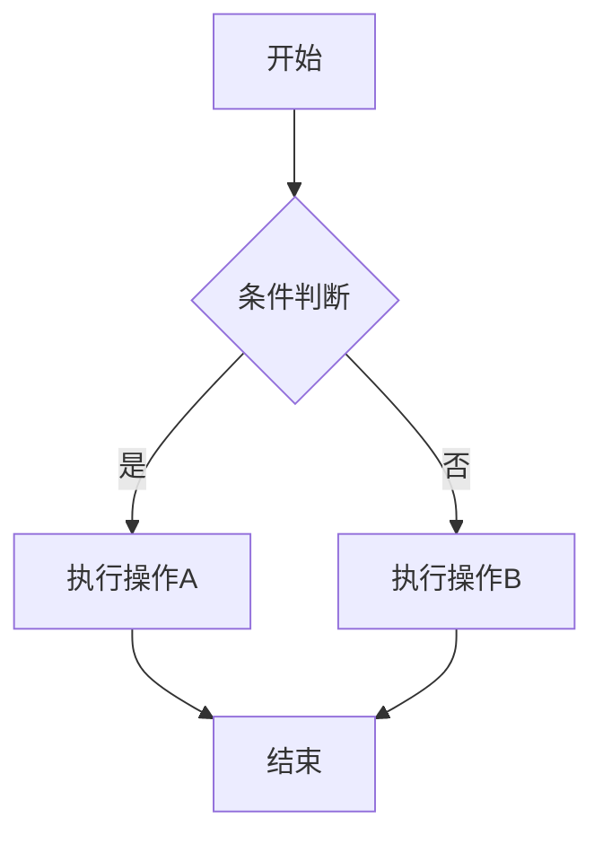
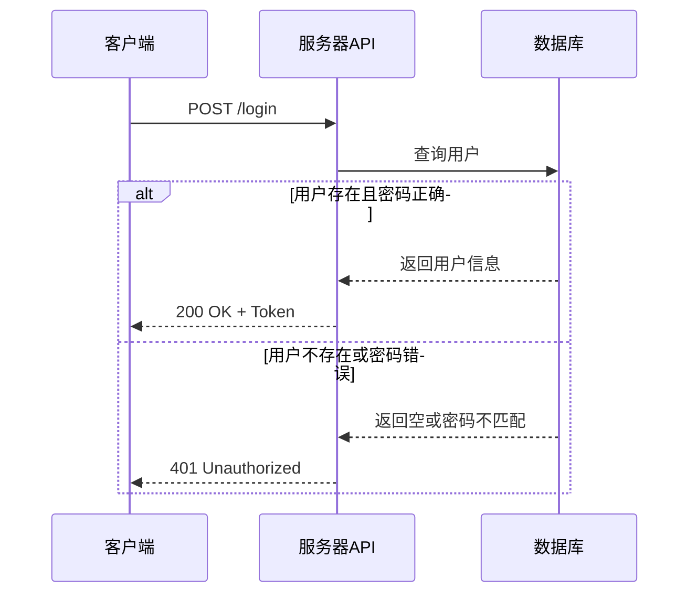
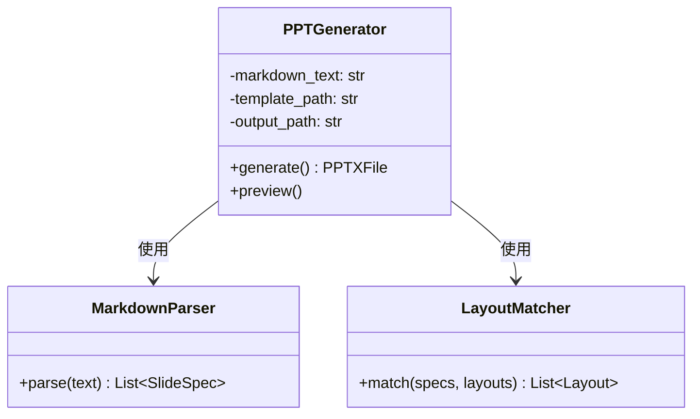
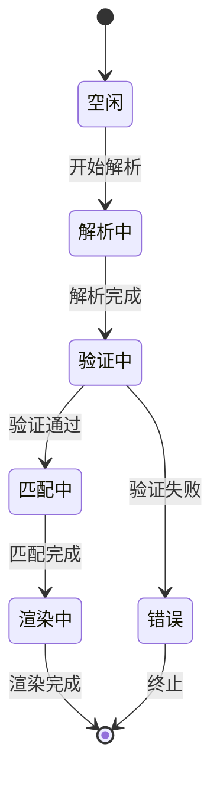

<!-- layout: Title Slide -->
# 高级功能演示

代码高亮 · Mermaid图表 · LaTeX公式

<!-- layout: Title and Content -->
# 代码高亮

支持多种编程语言的语法高亮：

```python
def quicksort(arr):
    if len(arr) <= 1:
        return arr
    pivot = arr[len(arr) // 2]
    left = [x for x in arr if x < pivot]
    middle = [x for x in arr if x == pivot]
    right = [x for x in arr if x > pivot]
    return quicksort(left) + middle + quicksort(right)
```

<!-- layout: Title and Content -->
# JavaScript示例

```javascript
const compose = (...fns) => x => fns.reduceRight((acc, fn) => fn(acc), x);

const double = x => x * 2;
const square = x => x * x;
const addFive = x => x + 5;

const pipeline = compose(addFive, square, double);
console.log(pipeline(3)); // 23
```

<!-- layout: Title and Content -->
# 流程图



<!-- layout: Title and Content -->
# 序列图



<!-- layout: Title and Content -->
# 类图



<!-- layout: Title and Content -->
# 状态图



<!-- layout: Title and Content -->
# LaTeX数学公式

## 基础公式

欧拉公式：$e^{i\pi} + 1 = 0$

勾股定理：$a^2 + b^2 = c^2$

## 求和公式

$\sum_{i=1}^{n} i = \frac{n(n+1)}{2}$

$\sum_{k=0}^{\infty} \frac{1}{2^k} = 2$

## 积分公式

$\int_{0}^{\infty} e^{-x^2} dx = \frac{\sqrt{\pi}}{2}$

$\frac{d}{dx} \int_{a}^{x} f(t) dt = f(x)$

## 矩阵

$A = \begin{bmatrix}
1 & 2 & 3 \\
4 & 5 & 6 \\
7 & 8 & 9
\end{bmatrix}$

行列式：$\det(A) = \begin{vmatrix}
a & b \\
c & d
\end{vmatrix} = ad - bc$

<!-- layout: Title and Content -->
# 组合演示

## 代码与图表结合

```python
import numpy as np

def sigmoid(x):
    return 1 / (1 + np.exp(-x))

# 神经网络前向传播
def forward(X, W, b):
    z = np.dot(X, W) + b
    return sigmoid(z)
```


<!-- layout: Title Slide -->
# 总结

预渲染管线支持：

* **代码高亮**：支持多种编程语言
* **Mermaid图表**：流程图、序列图、类图、状态图等
* **LaTeX公式**：数学公式渲染

所有内容预渲染为图片，确保在PPT中完美显示。